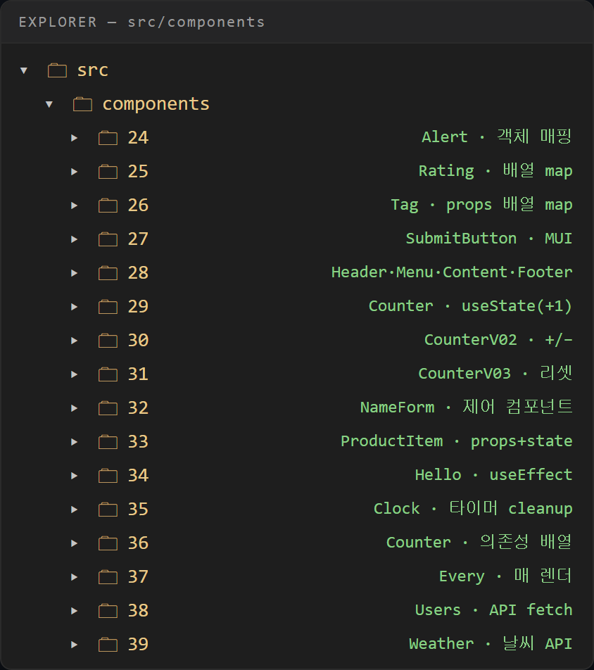
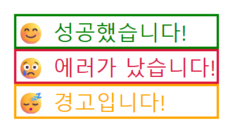
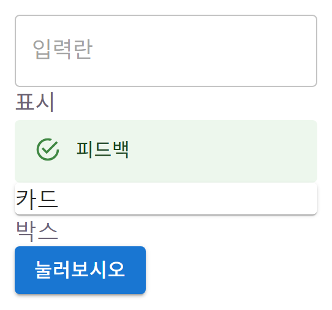

# 웹 개발 9일차 (1) — 객체로 매핑하고, 배열로 뿌리고, MUI도 살짝

> 어제(8일차)는 컴포넌트 + Props까지 했으니, 오늘은 그 다음이다.
> `if`를 여러 번 쓰는 대신 **객체 하나로 딱 매핑**하는 법, **배열을 `.map()`으로 돌려서** 컴포넌트를 리스트로 뽑아내는 법, 그리고 완성 부품을 가져다 쓰는 **MUI 라이브러리**까지 훑었다.
> 오늘 하루 분량이 꽤 많아서 총 4편으로 나눴는데, 이 글은 그 첫 편.



---

## 0. 오늘의 요약

- **객체 매핑(24)**: `type`에 따라 다른 스타일/아이콘을 보여줄 때, `if`를 여러 번 쓰지 않고 객체 하나에 다 넣어두고 `map[type]`으로 바로 꺼내 쓰는 패턴을 배웠다.
- **배열 메서드(25, 26)**: `.map()`으로 배열을 돌려서 각 요소마다 태그를 하나씩 뽑아내는 걸 두 가지 버전(숫자 개수만큼 반복 / props로 받은 배열)으로 해봤다.
- **MUI 라이브러리(27)**: `import`만으로 완성된 UI 부품을 가져다 쓰는 라이브러리를 처음 써봤다.

---

## 1. Alert — 객체로 타입별 스타일 매핑하기 (24)

`type`이 `success`/`error`/`warning` 셋 중 뭐냐에 따라 아이콘·색·테두리가 다 다르게 나오는 알람 박스를 만들었다.

```jsx
// components/24/Alert.jsx
const Alert = ({type, text}) => {
    const map = {
        success : { icon : '😊', color:'green', border:'2px solid', borderColor:'green'},
        error : { icon : '😢', color:'crimson', border:'2px solid', borderColor:'crimson'},
        warning : { icon : '😴', color:'orange',border:'2px solid', borderColor:'orange'}
    }
    const cfg = map[type]
    return <p style={{color:cfg.color, border:cfg.border, borderColor:cfg.borderColor}}>{cfg.icon} {text}</p>
}

export default Alert
```

핵심 흐름은 이거다:
1. `type` 값(문자열)을 **키**로 해서 `map` 객체 안에서 딱 맞는 설정 덩어리를 꺼낸다 → `cfg = map[type]`
2. 꺼낸 `cfg` 안의 값들(`icon`, `color`, `border`, `borderColor`)을 그대로 화면에 꽂아 쓴다.

`if (type === 'success') {...} else if (type === 'error') {...} ...` 이렇게 안 쓰고, **데이터(객체) 하나로 관리**하는 게 포인트였다.

### ⚠️ 용어 하나 바로잡음 — 이건 "배열"이 아니라 "객체"다

처음엔 `map`을 "객체 배열"이라고 불렀는데, 이건 틀린 표현이다. **배열은 `[ ]`+숫자 인덱스, 객체는 `{ }`+문자열 키**다. `map`은 `success`/`error`/`warning`이라는 **문자열 키**로 값을 찾아 쓰니까 명백히 **객체**다. 배열은 뒤에 나오는 Rating(25)·Tag(26)에서 진짜로 등장하니까, 여기서 헷갈리면 계속 헷갈리게 된다.

### 💥 삽질 기록 — CSS 키에 하이픈을 못 쓰는 이유

처음엔 이렇게 썼다가 바로 문법 에러가 났다.

```jsx
// ❌ 처음 쓴 것
border:'1px solid', border-color:'green'
```

이유는 두 가지가 겹쳐 있었다:

**(1) JS 객체 키에 하이픈(`-`)을 못 쓴다.** 따옴표 없는 객체 키에 `border-color`처럼 하이픈을 쓰면, JS는 이걸 `border` **빼기** `color`(뺄셈 연산)로 해석해버린다. CSS 문법(`border-color`)을 JS 객체 키에 그대로 가져다 쓸 수 없다는 걸 몰랐다.

**(2) React 인라인 스타일은 camelCase.** `style={{ }}` 안의 CSS 속성은 `border-color` → `borderColor`처럼 카멜케이스로 써야 한다. 하이픈이 없으니 따옴표 없이도 키로 쓸 수 있다.

```jsx
// ⭕ 고친 것
border:'2px solid', borderColor:'green'
```

여기서 하나 더 헷갈렸던 게, `style={{ }}`를 여러 속성 나열할 때 실수로 이렇게 썼던 것.

```jsx
// ❌ 객체를 3개 나열 (쉼표 연산자라 마지막 것만 적용됨)
style={{color:cfg.color}, {border:cfg.border}, {border:cfg.borderColor}}
```

`style={{ }}`의 중괄호 두 개는 **바깥은 "JS 표현식 삽입", 안쪽은 객체 하나**라는 뜻이다. 여러 속성은 **객체 하나 안에 쉼표로 나열**해야 한다.

```jsx
// ⭕ 객체 하나 안에 다 넣기
style={{color:cfg.color, border:cfg.border, borderColor:cfg.borderColor}}
```



---

## 2. Rating — 배열로 별점 찍기 (25)

숫자(`score`)만큼 별을 채워서 보여주는 컴포넌트.

```jsx
// components/25/Rating.jsx
const Rating = ({score}) => {
    return (
        <div>
            {[...Array(5)].map((_, i) => (
                <span key={i}>{i < score ? '⭐' : '☆'}</span>
            ))}
        </div>
    )
}

export default Rating
```

처음 볼 땐 `[...Array(5)].map((_, i) =>` 이 한 줄이 낯설었는데, 뜯어보면 세 가지가 겹쳐 있는 거였다.

1. **`[...Array(5)]`** — `Array(5)`만 쓰면 "길이만 5인 빈 칸(empty)" 배열이라 `.map`이 안 돈다. 스프레드(`...`)로 펼쳐줘야 `.map`이 돌 수 있는 진짜 5칸짜리 배열이 된다.
2. **`.map((_, i) => ...)`** — 첫 번째 인자 `_`는 각 칸의 값(안 씀, 버리는 관례), `i`는 인덱스(0~4). `key={i}`는 React가 리스트의 각 요소를 구분하는 데 필요하다.
3. **`i < score ? '⭐' : '☆'`** — 삼항 연산자로, 인덱스가 `score`보다 작으면 꽉 찬 별, 아니면 빈 별.

---

## 3. Tag — props로 받은 배열을 map으로 목록 렌더링 (26)

이번엔 숫자가 아니라 **부모가 넘겨준 배열(props)**을 그대로 돌리는 버전.

```jsx
// components/26/Tag.jsx
// 배열 tags를 map으로 펼쳐 칩 목록 그림
const Tag = ({ tags }) => {
  return (
    <div>
      {tags.map((tag) => (   // tags(복수 배열) → 요소 하나는 tag(단수)
        <span key={tag}>{'#' + tag}</span>   // '#'(샵)과 tag 값을 붙여 표시 → #react
      ))}
    </div>
  )
}
export default Tag
```

Rating이 "숫자로 배열 개수를 만들어서" map을 돌렸다면, Tag는 "이미 있는 배열(props)"을 그대로 map으로 돌리는 차이가 있다. `key={tag}`처럼 **값 자체를 key로 써도 되는 경우**(각 태그 문자열이 중복 없이 고유할 때)도 여기서 처음 봤다.

---

## 4. MUI 라이브러리 훑어보기 (27)

여기서부턴 직접 만드는 대신 **완성된 부품을 가져다 쓰는** 라이브러리를 처음 써봤다.

```bash
npm install @mui/material @emotion/react @emotion/styled
```

카테고리별로 뭐가 있는지 훑어봤는데:

| 분류 | 컴포넌트 | 뭐 하는 애 |
|---|---|---|
| 입력(Inputs) | TextField, Checkbox, Switch, Slider, Select, Radio | 글자 입력·체크·토글·슬라이더 |
| 표시(Data) | Typography, Avatar, Chip, Badge, Tooltip, Divider | 글씨·프로필·태그·알림점·툴팁 |
| 피드백 | Alert, Dialog, Snackbar, CircularProgress | 알림·팝업·토스트·로딩 스피너 |
| 표면(Surfaces) | Card, Accordion, Paper, AppBar | 카드·접이식·상단바 |
| 레이아웃 | Box, Stack, Container, Grid | 배치용 상자·정렬 |

실제로는 이렇게 여러 개를 한 번에 import 해봤다:

```jsx
// components/27/SubmitButton.jsx
// MUI 라이브러리를 사용한 버튼 구현
import {Button, TextField, Typography, Alert, Card, Box} from '@mui/material'

const SubmitButton = () => {
    return (
        <>
        <TextField placeholder='입력란'>입력</TextField>
        <Typography>표시</Typography>
        <Alert>피드백</Alert>
        <Card>카드</Card>
        <Box>박스</Box>
        <Button variant='contained' onClick={() => alert("눌러줘서 감사함다")
        }>눌러보시오 </Button>
        </>
    )
}

export default SubmitButton
```

`import`한 부품들을 하나씩 다 화면에 붙여봤다. 각각 뭐 하는 애인지 간단히:

- `<TextField>` — 글자 **입력칸**(테두리 있는 인풋)
- `<Typography>` — **글씨(텍스트)** 표시용
- `<Alert>` — **알림 박스** (MUI가 이미 만들어둔 완성형 — 초록 체크가 붙어 나온다)
- `<Card>` — **카드 모양** 표면
- `<Box>` — 배치용 **빈 상자**(`div` 같은 것)
- `<Button variant='contained'>` — **꽉 찬 색 버튼**, `onClick`으로 클릭 동작 연결

여기서 `variant='contained'`처럼 **props로 스타일·동작을 바꾸는 방식**이 우리가 직접 만든 컴포넌트랑 똑같다는 게 눈에 들어왔다. 특히 직접 손으로 만든 Alert(24)와, MUI가 이미 만들어둔 `<Alert>`를 나란히 보니 "완성된 부품을 가져다 쓴다"는 게 확 와닿았다.



---

## 오늘의 재사용 메모 (다음 나에게)

- ✅ **`type`별로 분기가 많아지면 `if` 대신 객체 매핑** — `const cfg = map[type]`
- ✅ **객체({}+문자열 키) vs 배열([]+숫자 인덱스)** — 헷갈리지 말 것
- ✅ **JS 객체 키엔 하이픈 금지** — CSS `border-color`는 JS/React에서 `borderColor`(camelCase)
- ✅ **`style={{ }}`는 객체 하나** — 여러 속성은 그 안에 쉼표로 나열
- ✅ **`[...Array(N)]`로 펼쳐야 `.map`이 돈다** — `Array(N)` 그 자체는 빈 칸이라 안 됨
- ✅ **MUI 같은 라이브러리는 `import`만으로 완성 부품**을 가져다 쓰는 것

---

## 마무리 + 다음 글 예고

오늘 배운 것 중 "if 대신 객체", "배열은 map"이 특히 재사용도가 높을 것 같다. 다음 글(9일차 (2))부턴 진짜 **외부 API에서 데이터를 fetch로 가져와서** 화면에 뿌리는 실습으로 넘어간다 — 이번엔 내가 만든 가짜 데이터가 아니라 진짜 인터넷 너머의 데이터라 좀 더 실전 느낌이었다.

> 객체·배열은 이제 "아 그거"하고 손이 좀 가는데, fetch는 아직 눈에 설다. 다음 글에서 제대로 파보자.
