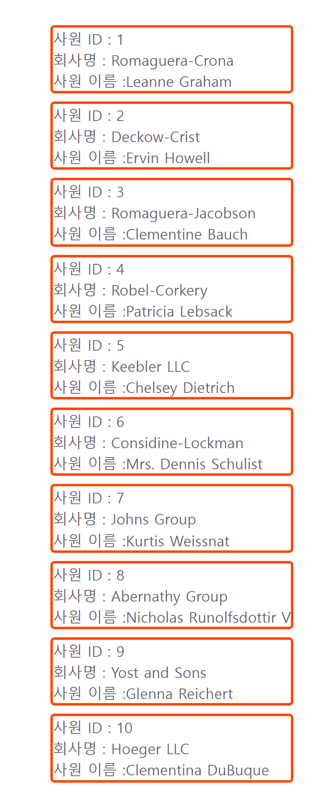
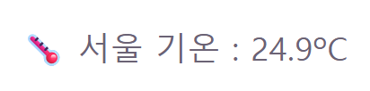

# 웹 개발 9일차 (2) — fetch로 API 데이터 가져와서 화면에 뿌리기

> 1편에서 객체·배열·MUI까지 훑었으니, 이번엔 진짜 실전이다.
> 지금까지는 내가 코드 안에 직접 써넣은 가짜 데이터만 다뤘는데, 오늘은 처음으로 **인터넷 너머 진짜 API에서 데이터를 가져와서** 화면에 뿌려봤다.
> `.then` 체이닝 구조가 눈에 잘 안 익어서 헤맸는데, 그 과정에서 큰 오해 하나도 바로잡았다.



---

## 0. 오늘의 요약

- **fetch(38)**: `fetch('URL').then().then().catch()` 구조로 외부 API에서 데이터를 받아와 `useState`에 저장하고 화면에 뿌리는 기본 패턴을 배웠다.
- **async/await(39)**: 같은 걸 `async/await` 문법으로 다시 써보면서 비교했다.
- **오개념 하나 정정**: `.then`은 동기, `async/await`는 비동기라고 착각했었는데 — **둘 다 비동기**다.

---

## 1. fetch 기본 구조 뜯어보기

오늘 계속 나온 뼈대는 이거였다.

```js
fetch('API주소')
  .then((res) => res.json())      // 응답을 JSON으로 변환
  .then((data) => { /* data 사용 */ })  // 변환된 데이터 사용
  .catch((error) => { /* 에러 처리 */ })
```

`fetch`는 요청을 보내고 **Promise**(나중에 결과가 도착할 거라는 약속표)를 즉시 리턴한다. `.then()`은 "그 약속이 이행되면(응답이 오면) 이걸 실행해줘"라는 뜻이고, 체인으로 이어 붙이면 순서대로 처리된다. 마지막 `.catch()`는 중간에 뭔가 실패했을 때(네트워크 에러 등) 대신 실행된다.

---

## 2. Users — 유저 목록 API 불러와 렌더링 (38)

```jsx
// components/38/Users.jsx
// 데이터 받아오는 예제
import { useState, useEffect } from "react";
import './Users.css'

const Users = () => {
    // users : 받아온 목록 (초기값 빈 배열 - 도착 전엔 비어있음)
    const [users, setUsers] = useState([])

    useEffect(() => {
        //fetch 요청 -> .then 응답을 json으로 변환
        // -> .then 데이터를 state에 저장 -> .catch 에러 처리
        fetch('https://jsonplaceholder.typicode.com/users').then((res) => res.json()).then((data) => setUsers(data)).catch((error) => console.error('데이터 로딩 실패:', error))
    }, [])

    return (
        <ul>
            {users.map((u) => (
                <li className="user-card" key={u.id}>사원 ID : {u.id}
                 <p>회사명 : {u.company.name}</p>
                  사원 이름 :{u.name}</li>
            ))}
        </ul>
    )
}

export default Users
```

흐름을 정리하면:
1. `users` state를 **빈 배열**로 초기화 (데이터 도착 전이라 아직 아무것도 없음)
2. `useEffect(() => {...}, [])`로 **컴포넌트가 처음 뜰 때 딱 1번** fetch 요청
3. 응답이 오면 `setUsers(data)`로 state 갱신 → 자동으로 리렌더 → `users.map()`이 실제 데이터로 채워진 목록을 그림

`jsonplaceholder.typicode.com/users`이라는 테스트용 API에서 사원 ID, 이름, 회사명(`u.company.name`)까지 받아와서 뿌렸다.

### 🖌️ 덤 — 리스트 점(•) 안 보이게 하기

`<ul><li>`로 목록을 만들면 기본으로 점(•)이 붙는데, 이걸 없애려면 CSS에서 이렇게 하면 된다.

```css
li {
    list-style: none;
}
```

(참고로 `padding-left` 기본값은 그대로 남아서 왼쪽 여백이 좀 남을 수 있다. 딱 맞추려면 `padding: 0;`도 같이.)

---

## 3. Weather — 날씨 API 불러와 렌더링 (39)

```jsx
// components/39/Weather.jsx
import { useState, useEffect } from "react";

const Weather = () => {
    // temp: 기온 (초기값 null - 도착 전엔 값 없음)
    // isLoading : 로딩 상태 확인하여 가져오기
    const [temp, setTemp] = useState(null)
    const [isLoading, setIsLoading] = useState(true)

    useEffect(() => {
        fetch('https://api.open-meteo.com/v1/forecast?latitude=37.5&longitude=127&current_weather=true').then((res) => res.json()).then((data) => {setTemp(data.current_weather.temperature); setIsLoading(false)}).catch((error) => {
            console.error('기온 로딩 실패:', error); setIsLoading(false)})
    }, [])

    return (
    <p> 🌡️ 서울 기온 : {isLoading ? '불러오는 중...' : (temp ? temp + 'ºC' : '불러올 수 없습니다.')}</p>
)
}

export default Weather
```

여기서 새로 나온 게 `isLoading`이라는 **로딩 상태**다. 데이터가 아직 안 왔을 때("불러오는 중...")와 다 왔을 때(실제 기온)를 구분해서 보여주려고 state를 하나 더 뒀다. 처음엔 `temp`의 초기값을 실수로 `useState(true)`라고 써놨었는데(온도인데 boolean이라니), `null`로 고쳤다. 성공 경로만 테스트할 땐 차이가 안 보이는데, **fetch가 실패하는 경우(`.catch`)를 생각하면 차이가 확실히 드러난다** — 초기값이 `true`였다면 실패했을 때 `temp`가 그대로 `true`로 남아서 `"trueºC"`라는 이상한 글자가 뜨는 버그가 있었을 거다. `null`이면 실패 시 정상적으로 "불러올 수 없습니다."가 뜬다.



### ⚠️ 아직 안 고친 버그 — 기온이 정확히 0도면?

`temp ? temp + 'ºC' : '불러올 수 없습니다.'` 이 삼항식엔 숨은 함정이 있다. JS에서 **`0`은 falsy(거짓 취급)**다. 그래서 만약 기온이 정확히 0도로 응답이 오면, `temp`엔 진짜 숫자 `0`이 들어있는데도 `temp ? ... : ...`가 거짓 쪽으로 빠져서 **"불러올 수 없습니다."가 잘못 뜬다.** 겨울에 이 페이지를 다시 켰다가 딱 0도가 뜨면 재현될 버그라, 다음에 `temp !== null`처럼 명시적으로 체크하도록 고쳐야 할 숙제로 남겨둔다.

---

## 4. ⚠️ 오개념 정정 — ".then은 동기, async/await는 비동기"는 틀렸다

처음엔 `.then()` 체이닝 방식을 "동기 방식"이라고, 교재에 나온 `async/await` 방식을 "비동기 방식"이라고 서로 다른 카테고리로 착각했었다. 근데 이건 틀렸다.

**`.then()`이든 `async/await`든 둘 다 비동기(asynchronous)다.** `fetch` 자체가 Promise를 리턴하는 비동기 함수라서, 그걸 `.then()`으로 풀어쓰든 `await`로 풀어쓰든 **내부 동작은 완전히 동일**하다. `async/await`는 "다른 동기 방식"이 아니라, Promise 기반 코드를 **위에서 아래로 순서대로 읽히는 것처럼** 더 깔끔하게 쓰게 해주는 문법(syntactic sugar)일 뿐이다.

---

## 5. WeatherAsyn — 같은 걸 async/await로 다시 써보기 (39)

```jsx
// components/39/WeatherAsyn.jsx
import { useState, useEffect } from 'react'

const Weather = () => {
  const [temp, setTemp] = useState(null)
  const [isLoading, setIsLoading] = useState(true)

  useEffect(() => {
    const fetchWeather = async () => {
      try {
        const res = await fetch('https://api.open-meteo.com/v1/forecast?latitude=37.5&longitude=127&current_weather=true')
        const data = await res.json()
        setTemp(data.current_weather.temperature)
        setIsLoading(false)
      } catch (error) {
        console.error('기온 로딩 실패:', error)
        setIsLoading(false)
      }
    }
    fetchWeather()
  }, [])

  return <p>🌡️ 서울 기온: {isLoading ? '불러오는 중…' : (temp ? temp + '°C' : '불러올 수 없음')}</p>
}
export default Weather
```

나란히 놓고 비교하니 대응 관계가 딱 보인다:

| `.then` 체이닝 | `async/await` |
|---|---|
| `fetch(url).then(res => res.json())` | `const res = await fetch(url)` → `const data = await res.json()` |
| `.then(data => {...})` | (그냥 다음 줄) |
| `.catch(error => {...})` | `try { ... } catch (error) { ... }` |

즉 `.then`이 "다음 걸 콜백으로 이어붙이는" 방식이라면, `async/await`는 "그 콜백을 안 쓰고 마치 한 줄씩 순서대로 실행되는 것처럼" 보이게 해주는 것뿐 — 결과물은 완전히 같다. 다만 이 컴포넌트는 `useEffect(() => {...}, [])` 콜백 자체를 `async`로 못 만들어서 (React가 그걸 허용 안 함) `fetchWeather`라는 **별도의 async 함수를 안에서 만들고 바로 호출**하는 패턴을 쓴다는 것도 새로 알았다.

---

## 오늘의 재사용 메모 (다음 나에게)

- ✅ **`fetch(url).then().then().catch()`** — 요청 → 변환 → 사용 → 실패 처리 순서
- ✅ **로딩 상태(`isLoading`)를 따로 관리**하면 "불러오는 중..." UI를 자연스럽게 넣을 수 있다
- ✅ **`.then`과 `async/await`는 둘 다 비동기** — 문법만 다를 뿐 하는 일은 같다
- ✅ **falsy 값(`0`, `""`, `null`...) 조심** — 삼항식으로 "값 있음/없음"을 체크할 땐 `0`이 정상값일 수 있는 상황(온도, 개수 등)에선 `!== null`처럼 명시적으로 체크할 것
- ✅ **`useEffect`의 콜백 자체는 async로 못 만듦** — 내부에 async 함수를 따로 정의하고 즉시 호출하는 패턴 사용

---

## 마무리 + 다음 글 예고

fetch 구조가 처음엔 눈에 안 익었는데, Users랑 Weather 두 개를 나란히 만들어보고 `.then` vs `async/await`까지 비교하고 나니 감이 좀 잡혔다. 다음 글(9일차 (3))부턴 오늘 계속 등장했던 **`useState`를 제대로 파본다** — 카운터부터, 로그인 상태를 버튼으로 토글하려다 벽에 부딪힌 이야기까지.

> API에서 데이터가 진짜로 화면에 뿌려지는 걸 보니까 신기하긴 한데, 로딩 상태·에러 처리까지 챙겨야 한다는 걸 알고 나니 갈 길이 멀다는 것도 느꼈다.
