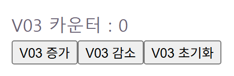

# 웹 개발 9일차 (3) — useState, 버튼 하나로 화면 바꾸기 (feat. Header 로그인 미완성기)

> 2편에서 fetch로 외부 데이터를 가져왔으니, 이번엔 안쪽으로 눈을 돌려서 **"내 컴포넌트가 스스로 기억하고 바꾸는 값"**, `useState`를 제대로 파봤다.
> 카운터부터 시작해서 입력창까지는 잘 따라갔는데, 마지막에 **Header에 로그인 토글 버튼**을 직접 붙여보려다가 제대로 막혔다. 그 과정도 솔직하게 다 적는다.



---

## 0. 오늘의 요약

- **컴포넌트 조립(28)**: Header·Menu·Content·Footer 네 부품을 `App.jsx`에 조립해서 배치하는 법을 배웠다.
- **props vs state(33)**: "밖에서 받은 고정값(props)"과 "내가 기억하고 바꾸는 값(state)"의 차이를 명확히 구분했다.
- **useState 기초~응용(29, 30, 31)**: 카운터로 +1 → +1/-1 → +1/-1/리셋까지 단계별로 익혔다.
- **제어 컴포넌트(32)**: `input`의 `value`+`onChange`로 타이핑한 값을 실시간으로 state에 반영하는 패턴.
- **미완성 숙제**: Header에 로그인 상태 토글 버튼을 붙이려다 실패 — 이유(원인)를 알아냈고, 마저 완성하는 건 숙제로 남김.

---

## 1. 여러 컴포넌트 조립하기 — Header/Menu/Content/Footer (28)

오늘 컴포넌트를 역할별로 나눠서 조립하는 법도 배웠다. HTML의 시맨틱 태그처럼 각자 위치가 있다.

```jsx
// components/28/Header.jsx (처음 버전)
const Header = () => <header>헤더</header>
export default Header
```

```jsx
// App.jsx
<Header></Header>
<Menu></Menu>
<Content></Content>
<Footer></Footer>
```

여기서 기존 컴포넌트들과 다른 점 하나 — **return 값이 화살표 함수 한 줄이면 `{}`도 `return`도 생략 가능**하다는 걸 알았다.

### 💥 삽질 기록 — Header가 자기 자신을 부르는 바람에 화면이 통째로 멈춤

`<header>` 태그를 만들다가 실수로 이렇게 썼다.

```jsx
// ❌
const Header = () => {
  return (
    <Header> 헤더 </Header>   // 소문자 header 태그가 아니라 컴포넌트 Header를 또 부름!
  )
}
```

`<Header>`(대문자, 컴포넌트)와 `<header>`(소문자, HTML 태그)를 착각해서, Header 컴포넌트가 **자기 자신을 무한히 렌더링**하는 상태가 됐다. 결과는 스택 오버플로우로 화면 전체가 크래시. `<header>`로 소문자만 고쳤는데도 화면이 계속 안 나와서 당황했는데, 알고 보니 **코드는 고쳤어도 브라우저가 그 크래시 화면에 멈춰있던 것**이었다. 새로고침(F5) 한 번으로 해결됐다.

> Vite의 자동 새로고침(HMR)은 대부분 변경을 알아서 반영해주지만, 렌더 도중 치명적 크래시(무한 재귀 등)가 나면 스스로 복구를 못 하는 경우가 있다 — 그럴 땐 그냥 새로고침.

---

## 2. props vs state, 한 줄 정리 (33)

ProductItem이라는 컴포넌트를 만들면서 이 둘의 차이를 명확히 정리했다.

```jsx
// components/33/ProductItem.jsx
//  부모가 준 name(props) 표시 자기만의 개수 (state)를 기억
// props = 외부에서 받은 고정 값 / state = 내가 기억하고 바꾸는 값 (이 둘의 차이가 핵심!)

import './ProductItem.css'
import { useState } from "react";

const ProductItem = ({name}) => {
    const [count, setCount] = useState(0)
    return (
        <div>
            <div className="product">
                <h3>{name}</h3>     {/** props 표시 */}
                <p>{count} 개 담았음</p>    {/** state 표시 */}
            </div>
            <button onClick={() => setCount(c => c + 1)}>¥ 담기</button>
        </div>
    )
}

export default ProductItem
```

`name`은 부모(`App.jsx`)가 넘겨준 값이라 이 컴포넌트 안에서 못 바꾼다(읽기 전용). 반면 `count`는 버튼을 누를 때마다 컴포넌트 스스로 바꾸는 값이다. **"밖에서 받았나 vs 내가 기억하고 바꾸나"**가 둘을 가르는 기준이라는 게 이 주석 한 줄로 확 정리됐다.

---

## 3. 카운터 — +1부터 +1/-1/리셋까지 (29, 30, 31)

단계별로 하나씩 늘려가며 익혔다.

```jsx
// components/29/Counter.jsx — 1단계: +1만
const Counter = () => {
    const [count, setCount] = useState(0)
    return (
        <button onClick={() => setCount(c => c + 1)}>
            {count} 번 눌렀습니다.
        </button>
    )
}
```

```jsx
// components/30/CounterV02.jsx — 2단계: +1 / -1
const CounterV02 = () => {
    const [count, setCount] = useState(0);
    return (
        <div className="plus-minus-card">
            <p className="out-count">{count}</p>
            <button onClick={() => setCount(c => c + 1)}>횟수 증가</button>
            <button onClick={() => setCount(c => c - 1)}>횟수 감소</button>
        </div>
    )
}
```

```jsx
// components/31/CounterV03.jsx — 3단계: +1 / -1 / 리셋
const CounterV03 = () => {
    const [count, setCount] = useState(0);
    return (
        <div>
            <p>V03 카운터 : {count}</p>
            <button onClick={() => setCount(c => c + 1)}>V03 증가</button>
            <button onClick={() => setCount(c => c - 1)}>V03 감소</button>
            <button onClick={() => setCount(0)}>V03 초기화</button>
        </div>
    )
}
```

### ⚠️ 헷갈렸던 부분 — `setCount(c => c + 1)`가 정확히 뭘 하는 건지

`useState`의 setter는 두 가지 방식을 받는다.

```js
setCount(5)            // 방식 A: "다음 값은 이거야" (직접 값)
setCount(c => c + 1)   // 방식 B: "이전 값(c)을 받아서 계산한 결과를 다음 값으로 써" (함수형)
```

방식 B를 쓰면 React가 실제로 상태를 갱신하는 시점에 그 함수를 호출해서, **그 시점의 최신 이전 값**을 인자로 넣어주고 리턴값을 새 상태로 쓴다.

**규칙: 새 값이 이전 값에 의존하면 함수형(B), 의존하지 않으면 직접 값(A).**
- `+1`, `-1`은 "이전 값에서 하나 더하기/빼기"라 반드시 이전 값이 필요 → 함수형이 안전
- `초기화`는 "이전 값이 뭐였든 무조건 0" → 이전 값이 필요 없음 → `setCount(0)`이 더 간단

(참고로 `c => c = 0`처럼 파라미터에 대입하는 방식도 결과적으로는 동작은 하지만, 함수 파라미터를 안에서 재할당하는 건 의도가 불분명해지는 나쁜 스타일이라 `c => 0` 또는 그냥 `setCount(0)`을 쓰는 게 낫다.)

---

## 4. NameForm — 제어(controlled) 컴포넌트 (32)

입력창에 타이핑한 값을 실시간으로 화면에 반영하는 패턴.

```jsx
// components/32/NameForm.jsx
// state로 붙잡아 실시간 사용 ( 검색, 로그인, 댓글 등)
// 입력값과 화면을 항상 일치 = controlled(제어) 컴포넌트
import {useState} from 'react'

const NameForm = () => {
    const [name, setName] = useState("")

    return (
        <>
        <input value={name}
            onChange={(e) => setName(e.target.value)}
        />
        <p>안녕, {name}</p>
        </>
    )
}

export default NameForm
```

### ⚠️ 오개념 정정 1 — `value={name}`이 하는 일

`{name}`이 `<p>`에서 갱신되는 건 `value={name}` 없이 `onChange`만 있어도 잘 된다. `value={name}`이 진짜 하는 일은 **`<input>` 박스 자체가 보여주는 내용을 state와 강제로 일치시키는 것**이다. 예를 들어 나중에 "지우기" 버튼으로 `setName("")`을 하면, `value={name}`이 있어야 입력창 안 글자도 실제로 사라진다(없으면 state는 바뀌어도 입력창은 브라우저가 자체 관리하는 값 그대로 남는다). 이게 "제어 컴포넌트"의 뜻 — React state가 유일한 정답(single source of truth)이 되는 것.

### ⚠️ 오개념 정정 2 — `e`는 "이전 값"이 아니라 이벤트 객체

`e`는 값이 아니라 **이벤트 정보 뭉치(SyntheticEvent)**다. `e.target.value`는 "이전 값에 추가로 반영"하는 게 아니라, **그 순간 input 박스에 이미 들어있는 전체 문자열**(브라우저가 키 입력을 이미 다 합쳐놓은 결과)이다.

### ⚠️ 오개념 정정 3 — `(e) => setName(e.target.value)`는 사실 "직접 값" 방식

화살표 함수가 두 겹이라 헷갈렸다. **바깥** `(e) => {...}`은 onChange 이벤트 핸들러 그 자체(방식 A/B랑 무관). **안쪽** `setName(e.target.value)`은 `setName`에 **문자열 값**을 넘기는 거라 방식 A(직접 값)다. `e.target.value`가 이미 완성된, 이전 name에 의존하지 않는 값이기 때문에 함수형이 필요 없다.

---

## 5. 다시 Header로 — 로그인 토글, 왜 안 됐을까

```jsx
// components/28/Header.jsx (현재 상태)
const Header = ({isLoggedIn}) => {
    let currentLogged = isLoggedIn;
    return (
        <>
            <title>여러 컴포넌트 붙여보기!</title>
            <header> 헤더
                <p> 로그인 상태 : {isLoggedIn ? <span>로그인</span> : <span>로그아웃</span>} </p>
                <button>{currentLogged ? <span>로그아웃하기!</span> : <span>로그인하기</span>}</button>
            </header>
        </>
    )
}
export default Header
```

목표는 버튼을 누를 때마다 "로그인/로그아웃"이 토글되고, 버튼 글자도 같이 바뀌는 거였다. `{ }`로 값을 표시하는 것까진 잘 됐는데, **버튼을 눌러도 아무것도 안 바뀐다.**

원인은 두 가지였다.

1. `<button>`에 `onClick`이 아예 없어서 눌러도 반응이 없다.
2. `let currentLogged = isLoggedIn`은 **일반 지역변수**라서, 컴포넌트가 렌더될 때마다 `isLoggedIn` prop 값으로 매번 초기화된다. 재할당해도 React가 "다시 그려야지"라고 인식하지 못한다.

즉, **"값이 바뀌면 화면도 같이 바뀌게" 하려면 `let` 변수가 아니라 `useState`가 필요하다** — 오늘 배운 카운터·NameForm이랑 완전히 같은 원리다. 이 부분은 시간이 부족해서 오늘은 여기까지만 했고, `useState`로 마저 완성하는 건 **숨은 과제로 남겨뒀다.**

---

## 오늘의 재사용 메모 (다음 나에게)

- ✅ **`<Header>`(컴포넌트)와 `<header>`(HTML 태그) 대소문자 조심** — 자기 자신을 부르면 무한 렌더로 크래시
- ✅ **props = 밖에서 받은 고정값 / state = 내가 기억하고 바꾸는 값**
- ✅ **`setX(prev => ...)` vs `setX(값)`** — 이전 값에 의존하면 함수형, 아니면 직접 값
- ✅ **제어 컴포넌트 = `value` + `onChange`** — 검색창, 로그인 폼, 댓글 입력 등 "입력값을 실시간 반영"해야 하는 모든 곳에 재사용
- ✅ **일반 변수(`let`)는 재렌더를 못 일으킨다** — 클릭해서 화면을 바꾸고 싶으면 반드시 `useState`

---

## 마무리 + 다음 글 예고

카운터·입력창까진 순조로웠는데, 막상 직접 응용(Header 로그인 토글)해보니까 "prop과 state를 구분해서 쓴다"는 게 머리로 아는 것과 손으로 되는 것 사이에 거리가 있다는 걸 느꼈다. 다음 글(9일차 (4))에서는 오늘 계속 같이 나왔던 **`useEffect`를 제대로 파본다** — 화면이 그려진 다음에 실행되는 코드, 타이머, 그리고 의존성 배열 이야기.

> "로그인 버튼 하나 토글하는 게 왜 이렇게 어렵지" 싶었는데, 알고 보니 필요한 개념(useState) 자체를 아직 안 붙였던 거였다. 이 숙제는 마저 끝내서 다음 글에 이어 적어야겠다.
