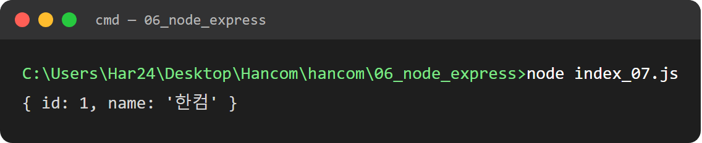
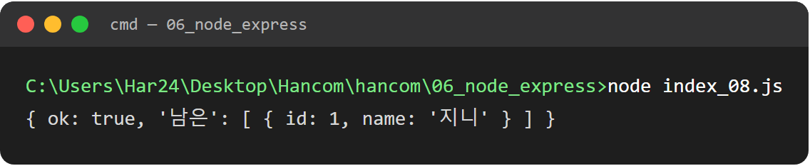
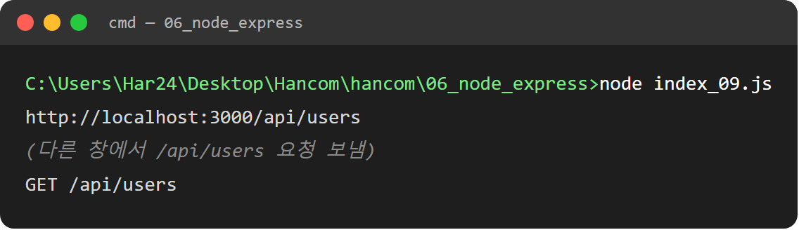

# 웹 개발 11일차 (2) — PUT·DELETE로 데이터 수정·삭제하고 CORS 미들웨어까지

> 1편에서 GET으로 꺼내오고 POST로 보내는 것까지 해봤으니, 이번엔 나머지 두 축인 **PUT(수정)**과 **DELETE(삭제)**를 마저 채우고, 마지막으로 다른 포트에서 오는 요청이 막히는 문제인 **CORS**까지 정리한다. CRUD(Create·Read·Update·Delete) 기준으로 보면 오늘까지 해서 Read(GET)·Create(POST)·Update(PUT)·Delete(DELETE) 네 가지를 다 찍어본 셈이다.

---

## 0. 들어가며

1편 요약: GET으로 유저 목록/특정 유저를 조회했고, POST로 서버-프론트 간 메시지를 주고받았다. 오늘은 이미 있는 데이터를 "바꾸고", "지우는" 쪽 + 여러 포트가 서로 통신할 때 막히는 문제(CORS)를 다룬다.

---

## 1. PUT으로 기존 데이터 수정하기

```js
// 이미 존재하는 항목을 PUT으로 수정하는 예제

const express = require('express')  // 1. 꺼내기
const app = express()   // 2. 만들기

app.use(express.json())  // JSON body 파싱 미들웨어

let users = [
    {id: 1, name: "JINI"},
    {id: 2, name: "KIM"}
]

// 3. 규칙 만들기
app.put('/api/users/:id', (req, res) => {
    const u = users.find(u => u.id === Number(req.params.id))
    if(!u) return res.status(404).json({error: "없는 유저입니다."})
    u.name = req.body.name
    res.json(u)
})

// 4. 문 열기
app.listen(3005, async () => {
    // 서버 켜지면 코드가 스스로 PUT 요청 -> 응답 출력 (curl 없이 확인)
    try {
        const res = await fetch('http://localhost:3005/api/users/1', {
            method: 'PUT',
            headers: { 'Content-Type': 'application/json'},
            body: JSON.stringify({ name: '한컴'})
        })
        console.log(await res.json())
    } catch(err) {
        console.error('❌ 에러:', err.message)
    }
})
```

- `app.put('/api/users/:id', ...)` — GET/POST와 구조는 똑같고 메서드만 `put`이다. HTTP 메서드는 결국 "같은 주소인데 뭘 하고 싶은지"를 구분하는 이름표라서, `:id`로 대상을 찾는 방식(`Number(req.params.id)`)은 1편 GET 때와 동일하다.
- 다른 점은 몸통이다 — GET은 조회만 하고 끝이지만, PUT은 찾아낸 객체 `u`를 **직접 수정**한다. `u.name = req.body.name`으로 배열 안 객체의 값을 그 자리에서 바꿔버린 다음, 바뀐 결과를 그대로 응답한다. `express.json()` 미들웨어가 여기서도 필요한 이유는 1편 POST 때와 같다 — `req.body.name`을 읽으려면 body를 객체로 풀어줘야 하니까.
- 재밌는 건 `app.listen`의 콜백을 통째로 `async`로 만들어서, **서버가 켜지자마자 코드가 스스로 자기 자신에게 PUT 요청을 보내도록** 짜놨다는 점이다. 원래는 Postman이나 curl 같은 별도 도구로 요청을 보내야 확인할 수 있는데, 여기선 그럴 필요 없이 파일 하나만 실행하면 "요청 보내고 → 응답 받고 → 출력"까지 자동으로 끝난다. `await fetch(...)` → `await res.json()`으로 1편에서 `.then`으로 풀었던 걸 이번엔 `async/await`로 쓴 것도 같이 봐두면 좋다 — 하는 일은 같고 문법만 다르다.

실행하면:

```
> node index_07.js
```



id 1번 유저(`JINI`)를 찾아서 이름을 `'한컴'`으로 바꾼 결과(`{ id: 1, name: '한컴' }`)가 그대로 콘솔에 찍힌다.

---

## 2. DELETE로 데이터 삭제하기

```js
//

const express = require('express')
const app = express()

let users = [
    {id: 1, name: '지니'},
    {id: 2, name: '철수'}
]

// 삭제 - DELETE  /api/users/2 (그 id만 빼기 body 없어서 express.json() 불필요)
app.delete('/api/users/:id', (req, res) => {
    users = users.filter(u => u.id !== Number(req.params.id))
    res.json({ok: true, 남은: users})
    // -> 삭제 눈으로확인
})

app.listen(3000, async () => {
    // 서버 켜지면 코드가 스스로 DELETE  요청 -> 응답 출력 (curl 없이 확인)
    const res = await fetch('http://localhost:3000/api/users/2', {method: 'DELETE'})
    console.log(await res.json())   // -> {ok : true, 남은 : [{id: 1, name: '지니'}]}
})
```

- `app.delete('/api/users/:id', ...)`도 형태는 같은데, 삭제는 **body가 필요 없다**. "이 id를 지워라"는 정보가 주소(`:id`)에 이미 다 담겨 있어서, PUT처럼 새 값을 body로 보낼 필요가 없다. 그래서 이 파일엔 `app.use(express.json())`도 안 쓰여 있다 — 필요 없는 미들웨어는 안 넣는 게 맞다.
- 삭제 로직은 `filter`로 처리한다. `users.filter(u => u.id !== Number(req.params.id))`는 "삭제할 id와 **다른** 것들만" 걸러서 새 배열을 만드는 방식이다. 배열에서 직접 하나를 지우는 게 아니라 "지울 것만 빼고 새로 만든다"는 발상이라, 원본 배열을 직접 건드리는 것보다 실수할 여지가 적다.
- 응답에 `남은: users`처럼 삭제 후 남은 목록을 통째로 돌려주는 것도 눈여겨볼 습관이다 — 그냥 `{ok: true}`만 보내면 프론트 입장에선 "진짜 지워졌는지, 뭐가 남았는지" 다시 GET으로 확인해야 하는데, 이렇게 최신 상태를 같이 보내주면 프론트가 화면을 바로 갱신할 수 있다.

실행 결과:

```
> node index_08.js
```



id 2번(`철수`)을 지운 뒤 남은 목록(`{ ok: true, 남은: [{ id: 1, name: '지니' }] }`)이 응답으로 돌아온다.

---

## 3. 미들웨어와 CORS 이해하기

```js
// 미들 웨어 cors 에대한 실습

const express = require('express') // 1. 꺼내기
const cors = require('cors')    // npm install cors(최초 1회)

const app = express();  // 2. 서버 만들기

// 미들 웨어 설정은 항상 라우터(app.get 위에서 선언)위에서 선언
app.use(cors()) // 다른 포트(프론트 5173 등) 허용

// 객체로 해석 POST body => req.body
// 변환 전 : "{\name\": \민수"}"
// 변환 후 : {name: "민수"}
app.use(express.json()) 

app.use((req, res, next) => {
    console.log(req.method, req.url)    // 모든 요청 로그 확인
    next()  // 다음으로 넘김(안 부르면 멈춤)
})

// 3. 규칙 만들기
app.get('/api/users', (req, res) => {
    res.json([{id: 1, name: "KIM"}])
})

// 4. 문 열기
app.listen(3000, () => console.log("http://localhost:3000/api/users"))
```

여기까진 계속 `app.use(express.json())` 한 줄만 봤는데, 오늘은 미들웨어가 뭔지 제대로 정리했다.

**미들웨어란** — 요청(`req`)이 최종 목적지인 라우트(`app.get`, `app.post`...)에 도착하기 **전에** 거쳐가는 중간 처리 단계다. `app.use(...)`로 등록하면, 그 아래 있는 모든 라우트에 공통으로 적용된다. 그래서 순서가 중요하다 — 이 코드에서도 `cors()`, `express.json()`, 로그용 미들웨어가 전부 `app.get`보다 **위에** 선언돼 있다. 라우트보다 아래에 미들웨어를 넣으면 이미 응답이 끝난 뒤라 적용이 안 된다.

세 번째로 넣은 커스텀 미들웨어(`app.use((req, res, next) => {...})`)를 보면 미들웨어의 정체가 더 잘 보인다.
- 인자로 `req, res` 말고 `next`가 하나 더 있다. `next()`를 호출해야 다음 미들웨어(또는 최종 라우트)로 요청이 넘어간다 — **안 부르면 요청이 그 자리에서 멈춰버린다.**
- 여기선 `console.log(req.method, req.url)`로 어떤 요청이 들어왔는지 찍어보고 바로 `next()`로 흘려보내는, "로그만 남기고 통과시키는" 미들웨어다.

**CORS(Cross-Origin Resource Sharing)** — 브라우저는 기본적으로 "지금 페이지를 받아온 포트/도메인"과 **다른** 포트/도메인으로 가는 요청을 보안상 막는다. 예를 들어 프론트가 `5173`번 포트(vite 개발 서버)에서 떠 있고, 서버가 `3000`번 포트에 있으면 이건 "다른 출처(origin)"라서 브라우저가 응답을 막아버린다. `app.use(cors())`는 "이 서버는 다른 포트에서 오는 요청도 허용한다"고 명시적으로 풀어주는 미들웨어다. 이 줄이 없으면 서버는 정상 응답을 보냈는데도 브라우저 콘솔에 CORS 에러만 찍히고 프론트에선 데이터를 못 받는 상황이 생긴다 — 실제로는 서버가 문제가 아니라 브라우저가 막은 거라서, 처음 겪으면 원인 찾기가 까다로운 부분이라고 들었다.

실행하고 `/api/users`로 요청을 한 번 보내보면:

```
> node index_09.js
```



서버가 켜질 때 찍힌 주소 로그 다음에, 요청이 들어온 순간 커스텀 미들웨어가 찍은 `GET /api/users` 로그가 그대로 이어서 찍히는 걸 확인할 수 있다.

---

## 오늘의 재사용 메모 (다음 나에게)

- ✅ **PUT**: `:id`로 찾아서 `req.body`로 받은 값으로 덮어쓰기 (`express.json()` 필요)
- ✅ **DELETE**: `:id`로 찾아서 `filter`로 빼고 새 배열 만들기 (body 없어서 `express.json()` 불필요)
- ✅ **미들웨어**: `app.use(...)`로 등록, 라우트보다 **위에** 선언, `next()` 안 부르면 요청이 멈춤
- ✅ **CORS**: 다른 포트/도메인 요청을 브라우저가 기본적으로 막음 → `app.use(cors())`로 허용
- ✅ **PUT/DELETE도 `app.listen` 콜백 안에서 스스로 fetch**해서 curl 없이 바로 확인하는 패턴 — 1편에서 POST 확인할 때 쓴 방식과 이어짐

---

## 마무리

이걸로 GET·POST·PUT·DELETE 네 가지 메서드를 다 실습해봤고, 미들웨어랑 CORS까지 왜 필요한지 이해하고 나니까 서버 쪽 코드가 뭘 하는 애들인지 감이 좀 잡혔다. 다음엔 이 개념들을 다 묶어서 진짜 CRUD 과제(정상 명단이랑 서버 데이터를 비교해서 자동으로 맞추는 것)로 이어진다.
