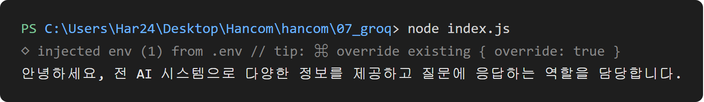

# 웹 개발 12일차 (1) — Groq API로 첫 AI 호출: Node에서 fetch로 LLM 부르기

> 어제(11일차)는 Node·Express로 서버를 세워서 GET·POST로 프론트랑 대화하는 것까지 해봤는데, 오늘은 그 서버가 "진짜 AI"랑 대화하는 쪽으로 넘어갔다.
> Groq이라는 곳에서 무료로 LLM API를 쓸 수 있길래, `fetch`로 외부 AI API를 직접 호출해보고 응답을 받아오는 것부터 시작했다. 나중에 이걸로 웹 챗봇까지 만들 거라 오늘은 "일단 터미널에서 AI랑 한 번 대화해보기"가 목표였다.

---

## 0. 오늘의 요약

- **Groq API가 뭔지**: OpenAI 스타일의 Chat Completions API 형식을 그대로 쓰는 LLM 서비스. `messages` 배열에 대화를 담아 보내면 AI 응답을 돌려준다.
- **`.env`로 API 키 숨기기**: `dotenv` 패키지로 `.env` 파일의 `GROQ_API_KEY`를 코드에 하드코딩하지 않고 불러오는 법.
- **`fetch`로 외부 API 호출**: `Authorization: Bearer <키>` 헤더를 붙여서 인증하는 법.
- **응답 구조 파악**: `data.choices[0].message.content`에 실제 AI 답변이 들어있고, optional chaining(`?.`)으로 안전하게 꺼내는 법.

---

## 1. Groq가 뭐고 왜 쓰는지

Groq는 LLM(거대 언어모델)을 API로 호출할 수 있게 해주는 서비스다. 신기했던 건 요청 형식이 OpenAI Chat Completions API랑 거의 똑같다는 것 — `messages`라는 배열 안에 `{ role: 'user', content: '...' }` 형태로 대화를 담아서 보내면, AI가 그 대화 맥락을 보고 답을 만들어서 돌려준다.

`role`은 지금은 `'user'`(내가 보낸 말)만 썼는데, 나중에 AI 답변을 `'assistant'`로 같이 넣어서 보내면 AI가 이전 대화까지 기억하고 답한다는 것도 알게 됐다 (이건 2편에서 직접 써먹었다).

---

## 2. `.env`로 API 키 숨기기

API 키를 코드에 그냥 적어두면 깃허브에 올리는 순간 그대로 노출된다. 그래서 `.env` 파일에 키를 따로 저장해두고, `dotenv` 패키지로 불러와 쓴다.

```js
require('dotenv').config()
const key = process.env.GROQ_API_KEY
```

`.env` 파일 안에는 이렇게 한 줄만 있으면 된다.

```
GROQ_API_KEY=여기에_발급받은_키
```

`require('dotenv').config()`을 실행하면 `.env`에 적힌 값들이 전부 `process.env`라는 객체 안에 들어간다. 그래서 그 이후로는 `process.env.GROQ_API_KEY`로 꺼내 쓸 수 있다. `.env` 파일 자체는 `.gitignore`에 넣어서 깃에는 절대 안 올라가게 해야 한다는 것도 다시 한번 짚고 넘어갔다.



실제로 `node index.js`를 실행하면 위 이미지처럼 dotenv가 `.env`를 읽어들였다는 로그(`◇ injected env (1) from .env`)가 먼저 뜨고, 그다음에 AI 응답이 출력된다.

---

## 3. `fetch`로 Groq API 호출하기

오늘 작성한 `index.js` 전체 코드는 이렇다.

```js
require('dotenv').config()
const key = process.env.GROQ_API_KEY

const main = async () => {

    const groqRes = await fetch("https://api.groq.com/openai/v1/chat/completions", {
        method: "POST",
        headers: {
            'Content-Type': 'application/json',
            // 사용권한 있음을 인증
            // Bearer 방식은 'Bearer ' 처럼 공백이 필수요소로 있어야함
            'Authorization': 'Bearer ' + key
        },
        body : JSON.stringify({
            model:'llama-3.1-8b-instant',
            messages: [{ role: 'user', content: '한 문장으로 자기소개 해줘'}]
        })
    })

    // 응답을 객체로 변환
    const data = await groqRes.json()

    // 이 안에 AI 답이 들어 있음
    // ? : 데이터 답이 없어도 에러가 나지 않도록 진행하는 문법
    console.log(data.choices?.[0]?.message?.content || data)
}


// main 정의 후 호출
main()
```

한 줄씩 뜯어보면:

- `fetch("https://api.groq.com/openai/v1/chat/completions", {...})` — Groq가 정해둔 채팅 API 주소로 요청을 보낸다. 두 번째 인자가 요청 내용이다.
- `method: "POST"` — 데이터를 실어 보내는 방식이라 GET이 아니라 POST를 쓴다.
- `headers`의 `'Content-Type': 'application/json'` — "내가 보내는 body는 JSON이다"라고 알려주는 것.
- `'Authorization': 'Bearer ' + key` — 이게 인증의 핵심이다. `Bearer` 뒤에 공백 하나가 꼭 있어야 하고, 그 뒤에 API 키를 붙인다. 이 헤더가 없거나 틀리면 Groq가 요청을 거절한다.
- `body: JSON.stringify({ model: ..., messages: [...] })` — 어떤 모델(`llama-3.1-8b-instant`)을 쓸지, 어떤 대화(`messages`)를 보낼지를 객체로 만들고 `JSON.stringify`로 문자열로 바꿔서 담는다.
- `main` 함수를 `async`로 만들고 안에서 `await`를 두 번 썼다 — 하나는 `fetch` 자체(요청을 보내고 응답이 올 때까지), 하나는 `groqRes.json()`(응답 본문을 실제 객체로 변환할 때까지). 둘 다 시간이 걸리는 비동기 작업이라서 `await`로 순서를 맞춰줬다.

---

## 4. 응답 구조 뜯어보기

Groq 응답(`data`)을 콘솔에 그대로 찍어보면 `choices`라는 배열 안에 결과가 들어있는 복잡한 구조인데, 내가 진짜로 필요한 건 그 안의 `choices[0].message.content` 딱 한 줄이다.

```js
console.log(data.choices?.[0]?.message?.content || data)
```

여기서 `?.`(optional chaining)을 쓴 이유가 인상 깊었다. 만약 요청이 잘못돼서 `choices`가 없는 에러 응답이 왔다면, `data.choices[0]`에서 바로 `TypeError: Cannot read properties of undefined`가 나면서 프로그램이 죽어버린다. `?.`을 쓰면 중간에 값이 없어도 에러 없이 그냥 `undefined`로 넘어가고, 마지막에 `|| data`로 "정상 응답이 없으면 원본 데이터라도 보여줘"라고 처리해둔 것이다. 에러 상황을 대비하는 방어적인 코드 패턴이라는 걸 알게 됐다.

---

## 마무리 + 다음 글 예고

터미널에서 AI랑 "대화 한 번"을 주고받는 건 성공했는데, 매번 코드를 고쳐서 질문을 바꿔야 하고 콘솔에만 찍히니까 아쉬웠다. 그래서 바로 이어서 **브라우저에서 진짜로 대화하듯 쓸 수 있는 웹 챗봇**을 만들어보기로 했다.

근데 여기서 문제가 하나 있다 — 지금 코드의 `key`(API 키)를 브라우저 쪽 코드에 그대로 옮기면 개발자도구로 누구나 볼 수 있게 된다. 이 문제를 어떻게 풀었는지는 다음 글(12일차 (2))에서 이어서 정리한다.
