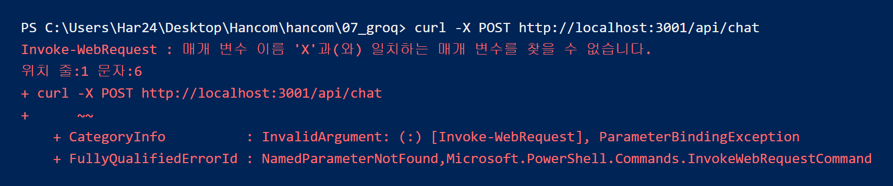
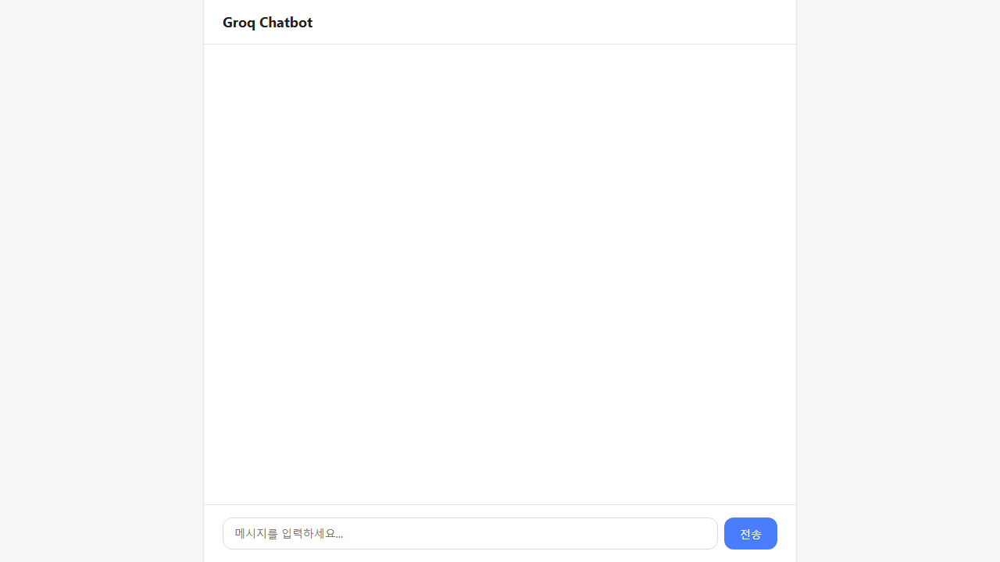
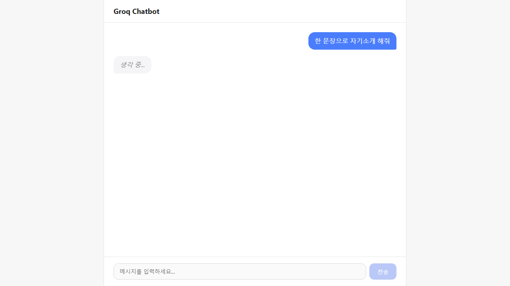
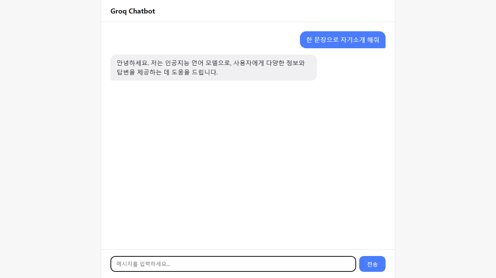

# 웹 개발 12일차 (2) — Express 프록시 서버로 웹 챗봇 완성하기

> 1편에서 터미널로 Groq API 한 번 불러봤으니, 오늘은 그걸 **브라우저에서 실제로 대화하는 챗봇**으로 만들어봤다.
> 처음엔 직접 한 줄씩 타이핑하면서 진행했는데, 라우트 경로 오타부터 PowerShell `curl` 이슈까지 실전 삽질을 꽤 겪었다. 시간이 좀 촉박해져서 서버의 Groq 연결 부분과 채팅 화면 전체는 AI 도움을 받아 마무리했는데, 그 코드도 한 줄씩 뜯어보면서 왜 이렇게 짰는지는 다 이해하고 넘어갔다.

---

## 0. 오늘의 요약

- **왜 프록시 서버가 필요한지**: 브라우저에서 API 키를 직접 쓰면 안 되는 이유와, Express 서버를 "중간 다리"로 세우는 구조.
- **`chatbot_server.js`**: `cors`, `express.json()`, `express.static()` 미들웨어 + `/api/chat` POST 라우트로 Groq 요청을 대신 보내주는 프록시.
- **실전 삽질 3가지**: 라우트 경로에 슬래시 빠뜨림 → `Cannot POST` / 코드 고치고 서버 재시작 안 함 / PowerShell에서 `curl -X`가 안 먹힘.
- **`chatbot_app.js`**: `messages` 배열로 대화 상태(state)를 관리해서, 매 요청마다 이전 대화 전체를 같이 보내는 멀티턴 챗봇 로직.

---

## 1. 왜 프론트에서 API 키를 직접 쓰면 안 될까

1편에서 쓴 `key = process.env.GROQ_API_KEY`는 Node(서버) 환경에서만 읽을 수 있는 값이다. 만약 이 코드를 그대로 브라우저용 JS 파일에 옮기면, 그 파일은 누구나 브라우저 개발자도구(F12) → 소스 탭에서 그대로 열어볼 수 있어서 API 키가 그대로 노출된다.

그래서 구조를 이렇게 가져가야 한다.

```
브라우저(chatbot_app.js, 키 없음)
   ↓ fetch
내 서버(chatbot_server.js, 키 보유 — 프록시 역할)
   ↓ fetch
Groq API
```

브라우저는 내 서버한테만 말을 걸고, 진짜 Groq API 호출과 키 사용은 서버 안에서만 일어난다. 이 구조를 이해하고 나니 어제 만든 `06_node_express`의 GET/POST 서버랑 원리가 똑같다는 걸 알았다 — 그냥 "중간에 서버 하나를 더 세워서 대신 심부름을 시키는 것"이었다.

---

## 2. `chatbot_server.js` — 프록시 서버

```js
// .env 파일의 GROQ_API_KEY를 process.env로 불러오기
require('dotenv').config()

// express 사용
const express = require('express')
const app = express()

// 다른 포트(주소)에서 오는 요청을 허용해주는 도구(미들웨어)
const cors = require('cors')
// 위 도구를 서버 전체 요청에 적용
app.use(cors())
// 요청 body(JSON 문자열)를 req.body 객체로 자동 변환
app.use(express.json())
// 같은 폴더의 정적 파일(html, js, css)을 그대로 서빙 (chatbot_index.html 등)
app.use(express.static(__dirname))

const key = process.env.GROQ_API_KEY

// 프론트에서 messages(지금까지의 대화 전체 배열)를 보내면
// 그걸 그대로 Groq에 전달해서 대화 맥락을 유지시킴
app.post('/api/chat', async (req, res) => {
    try {
        const messages = req.body.messages

        const groqRes = await fetch("https://api.groq.com/openai/v1/chat/completions", {
            method: "POST",
            headers: {
                'Content-Type': 'application/json',
                'Authorization': 'Bearer ' + key
            },
            body: JSON.stringify({
                model: 'llama-3.1-8b-instant',
                messages
            })
        })

        const data = await groqRes.json()
        const reply = data.choices?.[0]?.message?.content || '(응답 없음)'
        res.json({ reply })
    } catch (err) {
        console.error(err)
        res.status(500).json({ reply: '서버에서 오류가 발생했어요.' })
    }
})

app.listen(3001, () => console.log('http://localhost:3001/chatbot_index.html'))
```

새로 알게 된 부분들:

- **`app.use(express.static(__dirname))`** — 같은 폴더 안의 `chatbot_index.html`, `chatbot_app.js`, `chatbot_style.css`를 서버가 그대로 내려준다. 그래서 파일을 더블클릭해서 여는 게 아니라 `http://localhost:3001/chatbot_index.html`로 접속할 수 있다.
- **`req.body.messages`** — 1편에서는 `content: '한 문장으로 자기소개 해줘'`처럼 질문 하나를 고정해서 보냈는데, 여기서는 프론트가 지금까지의 대화 전체(배열)를 통째로 보내고 서버는 그걸 그대로 Groq에 전달만 한다. 이래야 AI가 "아까 내가 뭐라고 물어봤었지"를 기억한다.
- **`try/catch`** — Groq 쪽에서 에러가 나거나 네트워크가 끊겨도 서버 전체가 죽지 않고, `{ reply: '서버에서 오류가 발생했어요.' }`처럼 정상적으로 에러 응답을 돌려주게 했다.

---

## 3. 만들면서 겪은 삽질 3가지

### 삽질 1 — 라우트 경로에 슬래시를 빠뜨림

`app.post('api/chat', ...)`처럼 맨 앞 슬래시(`/`)를 빼먹고 등록했더니, 브라우저에서 요청을 보내자 아래처럼 떴다.


Express는 경로 문자열을 정확히 매칭하기 때문에, `/api/chat`으로 요청이 와도 `api/chat`(슬래시 없음)으로 등록된 라우트랑은 다른 걸로 취급해서 아예 못 찾은 것이었다. `app.post('/api/chat', ...)`로 슬래시를 붙이니 바로 해결됐다.

### 삽질 2 — 코드 고치고 서버 재시작을 안 함

라우트를 고쳤는데도 계속 옛날 응답(`{"reply":"test"}`)이 나와서 한참 헤맸다. 알고 보니 Node는 파일이 바뀌었다고 자동으로 다시 읽어들이지 않는다 — `node chatbot_server.js`로 켜둔 프로세스는 그 순간의 코드를 계속 메모리에 들고 있는 것이었다. 코드를 고칠 때마다 터미널에서 껐다가(`Ctrl+C`) 다시 켜야 반영된다는 걸 몸으로 배웠다. (나중에 `nodemon`을 쓰면 자동으로 재시작해준다고 들었는데, 오늘은 일단 수동으로 껐다 켰다.)

### 삽질 3 — PowerShell에서 `curl -X POST`가 안 먹힘

라우트 테스트하려고 `curl -X POST http://localhost:3001/api/chat`을 쳤는데 이런 에러가 났다.



알고 보니 PowerShell의 `curl`은 진짜 curl이 아니라 `Invoke-WebRequest`라는 다른 명령어의 별칭이라서, `-X` 같은 옵션 문법이 다르게 동작한다는 걸 처음 알았다. 해결은 둘 중 하나였다.

```powershell
curl.exe -X POST http://localhost:3001/api/chat        # 진짜 curl.exe를 직접 지정
Invoke-RestMethod -Uri http://localhost:3001/api/chat -Method Post   # PowerShell 방식
```

---

## 4. 프론트 — `messages` 배열로 멀티턴 대화 만들기

### `chatbot_index.html`

```html
<!DOCTYPE html>
<html lang="ko">
<head>
<meta charset="UTF-8">
<meta name="viewport" content="width=device-width, initial-scale=1.0">
<title>Groq Chatbot</title>
<link rel="stylesheet" href="chatbot_style.css">
</head>
<body>
    <div class="app">
        <header class="header">
            <h1>Groq Chatbot</h1>
        </header>

        <!-- 대화 내용이 쌓이는 영역 -->
        <main id="chat" class="chat"></main>

        <!-- 입력 영역: form이라 Enter로도 전송(submit) 됨 -->
        <form id="chat-form" class="input-area">
            <textarea id="input" placeholder="메시지를 입력하세요..." rows="1"></textarea>
            <button id="send-btn" type="submit">전송</button>
        </form>
    </div>

    <script src="chatbot_app.js"></script>
</body>
</html>
```

입력창(`#input`), 전송 버튼(`#send-btn`), 대화가 쌓이는 영역(`#chat`) 세 개가 핵심이고, `<form>`으로 감싸둬서 버튼 클릭뿐 아니라 Enter로도 제출(submit)되게 했다.

### `chatbot_app.js`

```js
const chatEl = document.getElementById('chat')
const formEl = document.getElementById('chat-form')
const inputEl = document.getElementById('input')
const sendBtn = document.getElementById('send-btn')

// 지금까지의 대화 전체를 담는 배열 (role: 'user' | 'assistant')
// 요청마다 이 배열 전체를 서버로 보내야 AI가 이전 대화 맥락을 기억함
const messages = []

// messages 배열을 기준으로 화면을 다시 그림
function renderMessages() {
    chatEl.innerHTML = ''
    messages.forEach(msg => {
        const div = document.createElement('div')
        div.className = 'message ' + msg.role
        div.textContent = msg.content
        chatEl.appendChild(div)
    })
    chatEl.scrollTop = chatEl.scrollHeight
}

function addMessage(role, content) {
    messages.push({ role, content })
    renderMessages()
}

// 응답 기다리는 동안 입력창/버튼 잠금
function setLoading(isLoading) {
    inputEl.disabled = isLoading
    sendBtn.disabled = isLoading
}

async function sendMessage(text) {
    addMessage('user', text)
    setLoading(true)

    // "생각 중..." 표시는 messages 배열에는 안 넣고 화면에만 임시로 추가
    const loadingEl = document.createElement('div')
    loadingEl.className = 'message assistant loading'
    loadingEl.textContent = '생각 중...'
    chatEl.appendChild(loadingEl)
    chatEl.scrollTop = chatEl.scrollHeight

    try {
        const res = await fetch('/api/chat', {
            method: 'POST',
            headers: { 'Content-Type': 'application/json' },
            body: JSON.stringify({ messages })
        })
        const data = await res.json()
        addMessage('assistant', data.reply || '(응답 없음)')
    } catch (err) {
        addMessage('assistant', '❌ 서버에 연결할 수 없어요.')
    } finally {
        setLoading(false)
        inputEl.focus()
    }
}

formEl.addEventListener('submit', (e) => {
    e.preventDefault()
    const text = inputEl.value.trim()
    if (!text) return
    inputEl.value = ''
    sendMessage(text)
})

// Enter: 전송 / Shift+Enter: 줄바꿈
inputEl.addEventListener('keydown', (e) => {
    if (e.key === 'Enter' && !e.shiftKey) {
        e.preventDefault()
        formEl.requestSubmit()
    }
})
```

가장 핵심은 **`messages` 배열이 대화 상태(state) 그 자체**라는 점이었다.

- 메시지가 생길 때마다(`addMessage`) 배열에 `push`하고, `renderMessages()`가 그 배열을 기준으로 화면(`#chat`)을 통째로 다시 그린다. React의 state → 렌더링 흐름이랑 원리가 똑같아서 이해가 빨랐다.
- "생각 중..." 로딩 버블은 `messages` 배열에는 안 넣고 DOM에만 임시로 붙여놨다가, AI 응답이 와서 `addMessage('assistant', ...)`가 실행되면 `renderMessages()`가 `chatEl.innerHTML = ''`로 화면을 통째로 지우고 다시 그리기 때문에 자연스럽게 사라진다.
- `fetch`의 `body`에 `{ messages }`(배열 전체)를 담아 보내는 게 1편에서 만든 `index.js`와 가장 다른 부분이다 — 질문 하나만 보내는 게 아니라 대화 기록 전체를 계속 실어 보낸다.
- Enter로 전송하되 Shift+Enter는 줄바꿈이 되게 `keydown` 이벤트에서 `e.shiftKey`로 분기했다.

---

## 5. 완성 화면



처음 접속하면 빈 채팅창만 보인다.



메시지를 보내면 내 메시지(파란 버블)가 먼저 뜨고, "생각 중..." 표시가 잠깐 나타난다.



Groq 응답이 도착하면 회색 버블로 AI 답변이 채워진다. 한글도 깨짐 없이 잘 나온다 — 참고로 중간에 `curl`로 테스트했을 때 한글이 깨져 보였던 건, Windows Git Bash가 명령줄 인자를 처리하는 방식 때문에 생긴 테스트 도구 쪽 문제였고, 실제 브라우저의 `fetch`는 문제없이 정확하게 인코딩한다는 것도 이번에 확인했다.

---

## 마무리

터미널에서 AI 한 번 불러보는 것과, 실제로 브라우저에서 "대화하듯" 챗봇을 쓰는 건 체감이 완전히 달랐다. 특히 프록시 서버 구조랑 `messages` 배열로 대화 맥락을 유지하는 방식은 나중에 다른 AI API를 붙일 때도 그대로 재사용할 수 있을 것 같다.

시간이 부족해서 서버의 Groq 연결부와 화면 전체는 AI 도움을 받아 완성했지만, 라우트 경로 슬래시 문제나 서버 재시작, PowerShell curl 이슈처럼 직접 부딪혀서 배운 것들이 오히려 더 오래 기억에 남을 것 같다. 다음엔 "새 대화 시작" 버튼처럼 빠진 기능들을 직접 채워보고 싶다.
