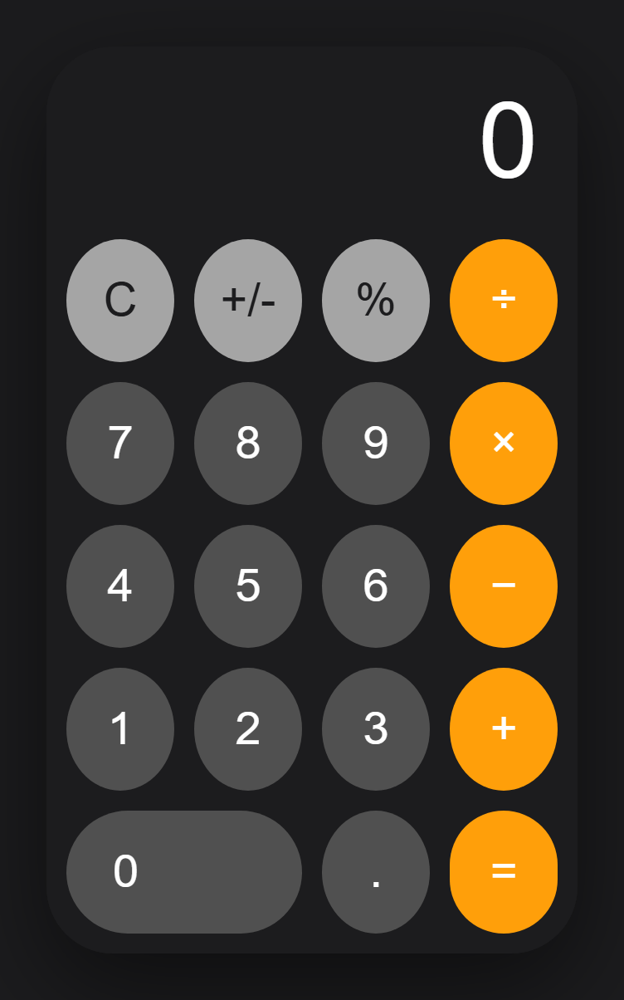
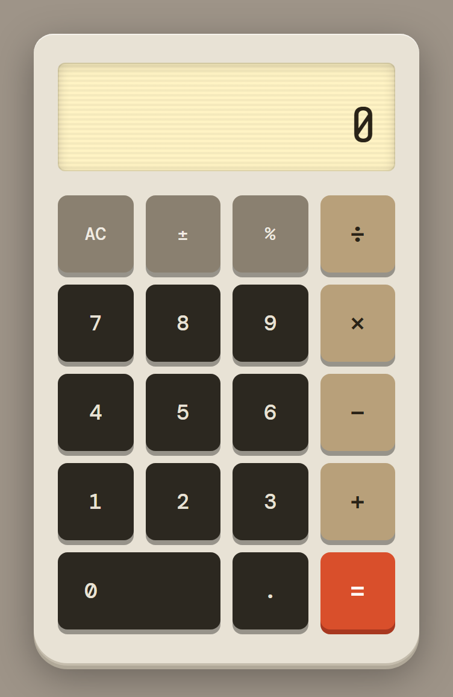
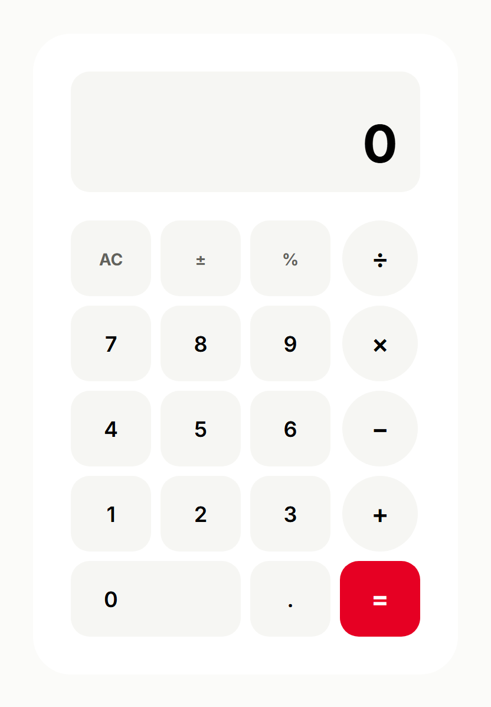

# 웹 개발 12일차 (5) — Claude Code로 웹사이트 만들기 (기본부터 디자인까지)

> 배포하는 법을 배웠으니, 이번엔 아예 **웹사이트를 만드는 것 자체를 AI한테** 시켜봤다.
> Claude Code한테 "계산기 만들어줘"라고 자연어로만 지시해서 똑같은 계산기를 여러 버전으로 만들었는데, **아무 지시 없이 만든 것 / 디자인 스킬을 켠 것 / design.md를 준 것**이 결과물이 확 달랐다. 같은 "계산기"인데 디자인이 이렇게 달라지는 게 재밌어서, 세 개를 나란히 비교해봤다.

---

## 0. 오늘의 요약

- **Claude Code 기본 흐름**: 자연어로 지시 → Plan Mode로 먼저 설계 → HTML/CSS/JS 생성 → 스크린샷·리뷰 반복. 직접 코딩 없이 동작하는 사이트가 나온다.
- **frontend-design 스킬**: 색·타이포·레이아웃을 "먼저 구상하고" 코드를 짜게 하는 공식 스킬. 켜면 밋밋한 기본형이 아니라 **의도가 있는 디자인**이 나온다.
- **design.md**: 브랜드의 색·글씨·간격·부품을 문서로 정리해두면, Claude가 그 문서를 읽고 **일관된 무드**로 만들어준다. (나는 Pinterest 디자인 시스템 문서를 써봤다.)
- **핵심 깨달음**: 같은 "계산기 만들어줘"라도 **무슨 재료(스킬/문서)를 주느냐**에 따라 결과물의 완성도가 완전히 달라진다.

---

## 1. Claude Code의 기본 흐름

Claude Code는 터미널/에디터에서 **자연어로 지시하면 코드를 대신 짜주는** AI 도구다. 교재에서 소개한 기본 워크플로우는 이렇다.

1. **자연어 지시** — "iOS 스타일 계산기 만들어줘" 같이 말로 시킨다.
2. **Plan Mode로 설계** — 바로 코드부터 쏟아내는 게 아니라, "어떤 파일을, 어떤 구조로 만들지" 계획을 먼저 세운다.
3. **코드 생성** — `index.html`, `styles/main.css`, `scripts/main.js`를 만든다.
4. **스크린샷 → 리뷰 → 수정 반복** — 결과를 눈으로 보고 고칠 점을 다시 지시한다.

내가 직접 코드를 한 줄도 안 썼는데도, 실제로 **버튼이 눌리고 계산이 되는** 계산기가 나왔다. 예를 들어 계산 로직 부분은 Claude가 이렇게 짜줬다.

```js
let current = '0';
let previous = null;
let operator = null;
let shouldReset = false;

function handleOperator(op) {
  if (operator && !shouldReset) {
    calculate();
  }
  previous = current;
  operator = op;
  shouldReset = true;
}

function calculate() {
  if (!operator || previous === null) return;

  const a = parseFloat(previous);
  const b = parseFloat(current);
  const ops = { '+': a + b, '-': a - b, '*': a * b, '/': a / b };
  const result = ops[operator];

  current = String(parseFloat(result.toFixed(10)));
  operator = null;
  previous = null;
  shouldReset = true;
}
```

- `current` / `previous` / `operator` — 지금 입력 중인 숫자, 직전 숫자, 누른 연산자를 담아두는 상태 변수들.
- `shouldReset` — 연산자를 누른 직후엔 화면을 비우고 새 숫자를 받아야 하니, "다음 숫자 입력 때 초기화할지" 표시하는 깃발.
- `handleOperator` — 연산자를 누르면, 이미 연산자가 눌려 있던 경우 먼저 계산하고, 지금 숫자를 `previous`로 밀어둔다.
- `calculate` — `previous`와 `current`를 `operator`에 맞춰 실제 계산. `ops` 객체로 `+ - * /`를 한 번에 매핑한 게 깔끔하다.
- `toFixed(10)` — 부동소수점 오차(0.1 + 0.2 = 0.300000...4 같은) 때문에 소수점을 정리하는 처리.

이 코드 그대로 렌더한 게 아래 첫 번째 계산기다. **아무 디자인 지시 없이** 만든 거라, 딱 봐도 아이폰 기본 계산기를 따라한 느낌이다.



*↑ 기본형 (디자인 지시 없음) — 검정 바탕 + 주황 연산자, iOS 계산기 클론*

---

## 2. frontend-design 스킬로 업그레이드

기본형은 잘 돌아가지만 "어디서 본 듯한" 디자인이다. 여기서 **frontend-design 공식 스킬**을 켜봤다. 이 스킬의 설명 첫 줄은 이렇다.

> *"Guidance for distinctive, intentional visual design... making choices that don't read as templated defaults."*
> (템플릿 같은 기본형으로 보이지 않는, 의도가 분명한 디자인을 하도록 안내)

스킬 문서(`SKILL.md`)를 보면, Claude한테 "작은 스튜디오의 디자인 리드처럼 굴어라. 팔레트·타이포·레이아웃을 이 브리프에 맞게 **일부러, 소신 있게** 골라라"라고 시킨다. 그래서 색을 먼저 정하고, 폰트를 고르고, 레이아웃을 구상한 다음에 코드를 짠다.

실제로 만들어진 CSS 상단엔 이렇게 **디자인 토큰**부터 정의돼 있었다.

```css
/* ── 디자인 토큰 ─────────────────────────────────── */
:root {
  --bg:       #E8E2D5;
  --ink:      #2A2318;
  --gold:     #B8A07A;
  --red:      #D94F2B;
  --key:      #2C2820;
  --display:  #FFF3C4;

  --font-display: 'Share Tech Mono', monospace;
  --font-ui:      'DM Mono', monospace;
}
```

- 색을 그냥 아무 데나 박은 게 아니라 `--bg`, `--gold`, `--red`처럼 **이름 붙은 변수**로 정리했다. 한 곳만 고치면 전체가 바뀐다.
- 폰트도 기본 산세리프가 아니라 `Share Tech Mono` 같은 **모노스페이스**를 골라서 레트로한 느낌을 냈다.

결과물이 확 달라졌다. 따뜻한 크림색 몸체 + 빈티지 LCD 느낌 디스플레이 + 빨간 `=` 버튼. "복고풍 탁상 계산기" 같은 뚜렷한 컨셉이 생겼다.



*↑ frontend-design 스킬 적용 — 레트로/빈티지 컨셉 (크림 바탕 + 나무색 키 + 빨간 = 버튼)*

---

## 3. design.md로 브랜드 시스템 입히기

마지막은 **design.md**를 주는 방식이다. design.md는 어떤 브랜드의 **색·글씨·간격·부품(버튼 등)을 문서로 정리한 디자인 명세서**다. `getdesign.md` 같은 갤러리에서 유명 브랜드의 design.md를 얻어올 수 있다.

나는 **Pinterest**의 디자인 시스템 문서를 써봤다. 문서 일부만 옮기면 이런 식으로, 색·radius·버튼 규칙이 아주 구체적으로 적혀 있다.

```markdown
### Brand & Accent
- **Pinterest Red** (`{colors.primary}` — `#e60023`): the brand's only
  highly-saturated color. Sign-up CTAs, active tab, brand wordmark.

### Border Radius Scale
| Token          | Value  | Use                                  |
|----------------|--------|--------------------------------------|
| `{rounded.md}` | 16px   | 버튼·인풋·카드 — 대부분의 컴포넌트 |
| `{rounded.lg}` | 32px   | 큰 카드·모달                        |
| `{rounded.full}`| 9999px| 검색바·칩·아바타                    |

### Do's and Don'ts
- Pinterest Red(#e60023)는 주요 CTA에만. 절대 장식용으로 쓰지 말 것.
- 다른 빨강으로 대체 금지 — 브랜드 레드는 정확히 #e60023.
```

이 문서를 주고 "이 디자인 시스템대로 계산기 만들어줘"라고 했더니, Claude가 문서의 규칙을 그대로 따랐다. **Pinterest Red(#e60023)를 `=` 버튼(=주요 액션)에만** 쓰고, 나머지는 크림색으로 차분하게, radius도 문서가 정한 값으로. 앞의 두 개랑 또 완전히 다른, "Pinterest스러운" 계산기가 나왔다.



*↑ Pinterest design.md 적용 — 브랜드 레드(#e60023)를 = 버튼에만, 크림 바탕의 깔끔한 시스템*

---

## 4. 세 개를 나란히 놓고 보니

같은 "계산기 만들어줘"인데, **무슨 재료를 줬느냐**에 따라 결과가 이만큼 달라졌다.

| 단계 | 준 것 | 결과물 느낌 |
|---|---|---|
| ① 기본 | (아무것도 안 줌) | iOS 계산기 클론, 무난하지만 흔함 |
| ② 스킬 | frontend-design 스킬 | 레트로 빈티지, 뚜렷한 컨셉 |
| ③ 문서 | Pinterest design.md | 브랜드 시스템대로, 일관된 무드 |

내가 오늘 제일 크게 느낀 건, AI한테 "만들어줘"라고만 하면 딱 평균적인(=흔한) 결과가 나오고, **디자인 방향을 스킬이나 문서 형태로 구체적으로 줄수록 결과물의 완성도와 개성이 올라간다**는 것이었다. 결국 AI를 잘 쓰는 것도 "무엇을, 얼마나 구체적으로 시키느냐"의 문제인 것 같다.

---

## 5. 마무리

오늘은 배포(Vercel) → 자동화(GitHub 연동) → 웹사이트 제작(Claude Code)까지, "만들고 → 올리는" 전체 흐름을 한 바퀴 돌아본 날이었다. 특히 계산기 세 개 비교는 캡처해두길 잘했다 싶다 — 나중에 "디자인 지시를 어떻게 주느냐"가 얼마나 중요한지 다시 보면 좋을 것 같다.

(오늘 배운 Anaconda 가상환경은, 나중에 Python을 실제로 다루기 시작할 때 따로 정리할 예정이다.)
