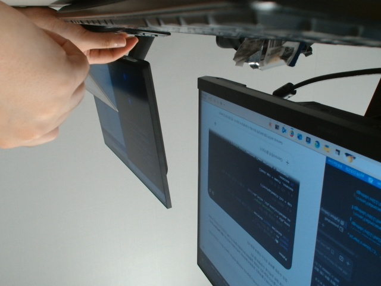
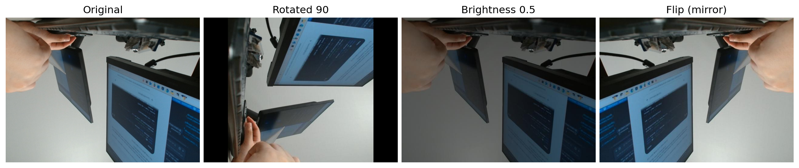

# 웹 개발 15일차 (1) — 웹캠으로 데이터 모으고, PIL로 증강하기

> 오늘부터 파트가 바뀌었다. 지금까지는 화면(웹)을 만들었다면, 오늘 오전부턴 **AI 모델이 먹을 데이터를 직접 모으고 다듬는** 쪽이었다.
> 첫 실습이 "코드로 내 웹캠 켜서 사진 찍기"였는데, `cv2.VideoCapture(0)` 한 줄로 카메라가 켜지는 게 신기했다.
> 그리고 그 사진 한 장으로 **회전·밝기·반전** 세 가지 변형본을 만드는 "데이터 증강"까지 이어졌다.



---

## 0. 오늘의 요약

- `cv2.VideoCapture(0)` → `.read()` → `cv2.imwrite()` 세 줄로 웹캠 사진 한 장을 코드로 찍고 저장할 수 있다.
- **데이터 증강(augmentation)** = 사진 한 장을 회전·밝기·반전 등으로 여러 장처럼 "불려서" 학습 데이터를 늘리는 작업. `Pillow(PIL)`의 `rotate()` / `ImageEnhance.Brightness()` / `ImageOps.mirror()`로 한다.
- 오후에 배울 YOLO도 결국 이렇게 모은 이미지를 재료로 쓰는 거라, 오늘 오전은 그 "재료 준비" 단계였다.

---

## 1. 웹캠으로 로컬 데이터 수집하기

시작 전에 conda 가상환경 들어가서 opencv 패키지부터 설치했다.

```bash
pip install opencv-python
```

그다음 실습 코드:

```python
import cv2 # 카메라를 다루는 도구
import os # 폴더를 만드는 도구
from datetime import datetime # 지금 시간을 알려주는 도구

#1. 사진을 지정할 폴더 준비 
save_dir = "./captured_images"
os.makedirs(save_dir, exist_ok=True)    # 폴더가 없으면 자동으로 생성

#2. 카메라를 키기
cap = cv2.VideoCapture(0)

#3. 사진 한 장 찍기
success, frame = cap.read() 
if success:
    timestamp = datetime.now().strftime("%y%m%d_%H%M%S") # 예 20260720_0920
    file_path = os.path.join(save_dir, f"result_{timestamp}.jpg")

    # 파일로 저장
    cv2.imwrite(file_path, frame)
    print(f"사진이 저장되었습니다. {file_path}")

else:
    print("카메라를 못 읽었습니다.")

#4. 카메라 끄기
cap.release()
cv2.destroyAllWindows()
```

한 줄씩 보면:

- `cv2.VideoCapture(0)` — 숫자 `0`은 "0번째 카메라"라는 뜻. 노트북 기본 웹캠이면 보통 0번이다.
- `cap.read()` — 카메라에서 프레임 한 장을 읽어온다. **`(성공 여부, 이미지)` 두 개를 동시에 돌려준다**는 게 특이했다. 그래서 `success, frame = cap.read()`처럼 한 번에 두 변수로 받는다.
- `os.makedirs(save_dir, exist_ok=True)` — 저장할 폴더가 없으면 자동으로 만들어줌. `exist_ok=True`가 없으면 폴더가 이미 있을 때 에러가 난다.
- `datetime.now().strftime("%y%m%d_%H%M%S")` — 파일명이 겹치지 않게 "찍은 시각"을 이름에 박아 넣는 방법. 오늘 실습에서 찍힌 사진도 `result_260720_093554.jpg`처럼 저장됐다 (2026년 07월 20일 09시 35분 54초).
- `cap.release()` / `cv2.destroyAllWindows()` — 카메라 자원을 꼭 반납해줘야 한다. 브라우저 탭 닫듯이, 안 닫으면 다음에 또 켤 때 꼬일 수 있다고 함.

위 사진이 실제로 이 코드를 돌려서 나온 결과다. 모니터 밑에서 손으로 뭔가 만지는 순간이 찍혔다ㅎㅎ

---

## 2. PIL로 이미지 증강하기 — 사진 한 장을 세 장처럼

AI 모델을 학습시키려면 사진이 많이 필요한데, 매번 새로 찍기는 힘드니까 **가지고 있는 사진을 살짝 변형해서 데이터 양을 늘리는 방법**이 "데이터 증강"이다. 방금 찍은 웹캠 사진으로 회전·밝기·반전 세 가지를 만들어봤다.

```python
from PIL import Image, ImageEnhance, ImageOps   # 이미지 증강
import matplotlib.pyplot as plt

# [1단계] 이미지 불러오기 — PNG·JPG 모두 가능
img = Image.open("captured_images/result_260720_093554.jpg")
img = img.convert("RGB")

# [2단계] 회전 — 90도 시계 방향
img_rotated = img.rotate(90)

# [3단계] 밝기 조절 — 0.5 = 원본의 50%
enhancer = ImageEnhance.Brightness(img)
img_brightness = enhancer.enhance(0.5)

# [4단계] 좌우 반전 — 거울처럼 뒤집기
img_flip = ImageOps.mirror(img)

# 3. 결과 시각화
fig , ax = plt.subplots(2,3,figsize=(20, 10))

# 3-1 원본 이미지
ax[0,0].imshow(img)
ax[0,0].axis('off')
ax[0,0].set_title('Original')

#3-2. 회전 이미지
ax[0,1].imshow(img_rotated)
ax[0,1].axis('on')
ax[0,1].set_title('Rotated 90')

#3-3 밝기 이미지
ax[0,2].imshow(img_brightness)
ax[0,2].axis('off')
ax[0,2].set_title('Brightness')

#3-4 좌우 반전 이미지
ax[1,0].imshow(img_flip)
ax[1,0].axis('off')
ax[1,0].set_title('Filp')

plt.show()
print("이미지 저장이 잘 됐습니다.")

# # [5단계] 저장 — 변환된 이미지 3장 출력
img_rotated.save("./img_rotated.jpg")
img_brightness.save("./img_brightness.jpg")
img_flip.save("./img_flip.jpg")
```

핵심만 뽑아보면:

- `img.rotate(90)` — 각도만 넣으면 회전. 90도 돌리니 가로 사진이 세로로 바뀌었다.
- `ImageEnhance.Brightness(img).enhance(0.5)` — `enhance()`에 넣는 숫자가 배율이다. `1.0`이 원본, `0.5`면 절반 밝기, `1.5`면 1.5배 밝게.
- `ImageOps.mirror(img)` — 좌우 반전(거울 모드). 위아래 반전은 `ImageOps.flip()`이라고 따로 있다고 배웠다.

시각화 부분에서 재밌었던 점 두 가지:

1. `plt.subplots(2,3, ...)`로 **2행 3열, 총 6칸짜리 격자**를 만들어놓고 실제로는 `ax[0,0]~ax[0,2]`, `ax[1,0]` 4칸만 채웠다. 그래서 실행하면 나머지 2칸(`ax[1,1]`, `ax[1,2]`)은 빈칸으로 뜬다. 처음엔 "어 왜 빈칸이 있지?" 했는데 격자 크기랑 실제 쓰는 칸 수가 다를 수 있다는 걸 알았다.
2. `print("이미지 저장이 잘 됐습니다.")`가 실제 `.save()` 코드들보다 **먼저** 쓰여 있다. 순서상으론 "저장 다 됐다"고 먼저 말해놓고 그다음에 진짜로 저장하는 셈이라 살짝 웃겼다ㅋㅋ (`plt.show()`가 창을 닫을 때까지 멈춰있는 함수라, 실제로는 내가 그래프 창을 닫아야 그 뒤 코드가 순서대로 실행된다.)

결과는 이렇다 — 원본 1장 + 증강 3장:



---

## 마무리

오늘 오전은 짧았지만 "AI용 데이터는 어떻게 만들어지는가"의 제일 앞단을 본 느낌이었다. 웹캠으로 찍고 → 그 한 장을 회전/밝기/반전으로 불려서 → 여러 장처럼 쓸 수 있게 만드는 흐름.

핵심만 다시 붙잡으면:

- **수집**: `cv2.VideoCapture(0)` → `.read()` → `cv2.imwrite()`
- **증강**: `rotate()` / `ImageEnhance.Brightness().enhance()` / `ImageOps.mirror()`

이렇게 모은(혹은 불린) 이미지를 오후엔 진짜 **YOLO 모델**에 넣어서 탐지·분류·분할·포즈 추정까지 해봤다. 그 얘기는 다음 글에서. 👉 [2편으로 이어짐]
