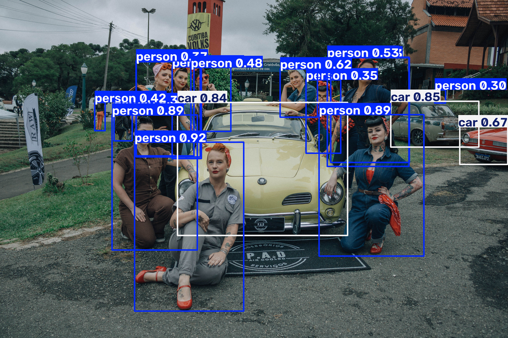
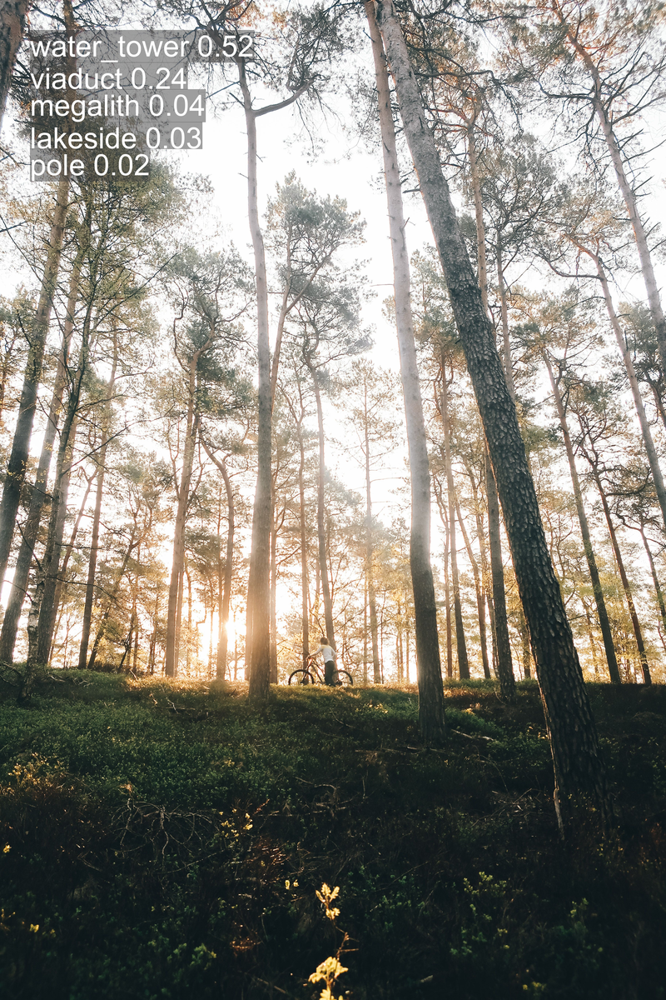
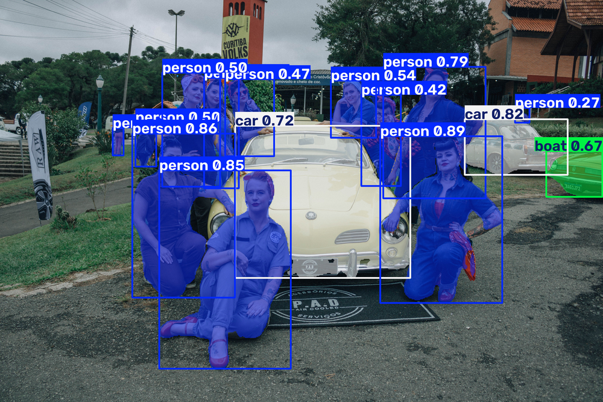
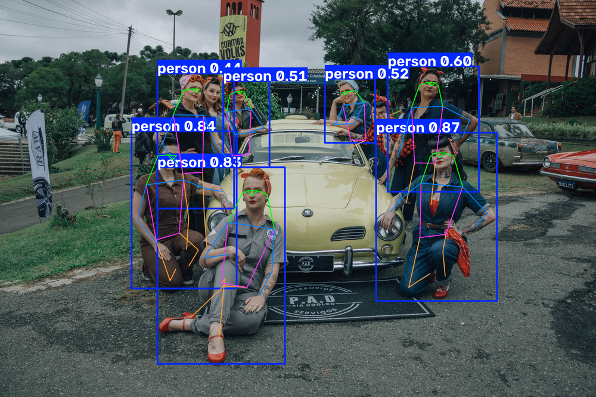
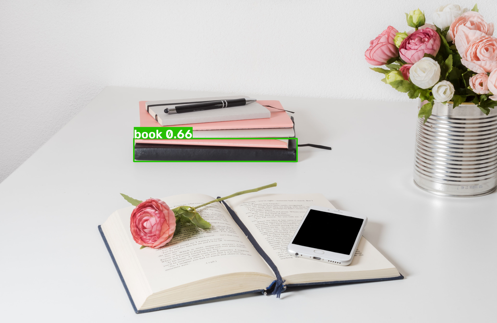
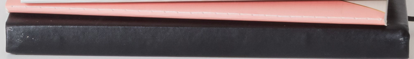

# 웹 개발 15일차 (2) — YOLO로 탐지·분류·분할·포즈부터 실시간 스트림·추적까지

> 오전엔 사진 한 장 다루는 것도 신기해했는데, 오후엔 그 사진을 **YOLO 모델**에 넣기 시작했다.
> 모델 이름 하나 바꾸는 것만으로 "뭐가 있는지 찾기(탐지)" → "이게 뭔지 맞히기(분류)" → "픽셀 단위로 오려내기(분할)" → "사람 자세 뽑기(포즈)"까지 다 되는 게 신세계였다.
> 마지막엔 실시간 CCTV 스트림에 모델을 물려서 "지금 몇 개 잡혔는지" 화면에 띄우는 것까지 해봤다.



---

## 0. 오늘의 요약

- YOLO는 태스크별로 **모델 파일(.pt)만 바꿔 끼우면** 탐지·분류·분할·포즈가 거의 같은 코드 패턴으로 돌아간다.
- `model(이미지경로)` 한 줄이면 추론 끝, `results[0].plot()`으로 결과를 그림으로 바로 받을 수 있다.
- `model(...)`에 `conf`, `imgsz`, `max_det`, `save_crop`, `classes` 같은 파라미터를 얹으면 탐지 결과를 세밀하게 조절할 수 있다.
- 실시간 스트림도 `cv2.VideoCapture(url)` + `while cap.isOpened()` 루프에 YOLO 추론만 끼워 넣으면 된다.
- `model.track()`을 쓰면 프레임이 바뀌어도 **같은 객체를 같은 ID로 추적**할 수 있다 (`persist=True`).

---

## 1. YOLO 기본 태스크 넷 — 탐지·분류·분할·포즈

네 가지 다 코드 뼈대가 거의 같다: **모델 로드 → `model(이미지)` 추론 → `results[0].plot()`으로 시각화 → `cv2.imwrite()`로 저장.** 다른 건 딱 하나, `YOLO(...)`에 넣는 **모델 파일 이름**뿐이다.

### ① 탐지 (Detection) — "뭐가 어디 있는지" 박스로 찾기

```python
from ultralytics import YOLO
import cv2

#1. 모델 로드
model = YOLO("yolo26n.pt")

#2. 모델 추론
# c:\Users\Har24\Downloads\pexels-mayaramombellifotografias-37539990.jpg
results = model("c:/Users/Har24/Downloads/pexels-mayaramombellifotografias-37539990.jpg")

#3. 결과 시각화
results_img = results[0].plot()

#4. 결과 이미지 저징
output_image_path = "./result_det.jpg"
cv2.imwrite(output_image_path, results_img)
print(f"저장되었습니다.{output_image_path}")
```

`yolo26n.pt`처럼 기본 가중치 파일 하나면 사람/차 같은 일반적인 객체(COCO 80종)를 바로 찾아준다. 위 대문 사진이 이 코드 결과인데, 오른쪽 끝 빨간 차가 `boat 0.67`로 탐지된 게 눈에 띈다. 사람 눈엔 딱 봐도 자동차인데 모델은 보트로 착각한 것 — **신뢰도(confidence)가 정답을 보장하진 않는다**는 걸 실제로 본 순간이었다.

### ② 분류 (Classification) — "이 사진 전체가 뭔지" 맞히기

```python
from ultralytics import YOLO
import cv2

# 1. 모델 로드
model = YOLO("yolo11n-cls.pt")
# n => s => m => l => x


# 2. 모델 추론
results = model("c:/Users/Har24/Downloads/pexels-ssteenbergenn-3621344.jpg")

# 3. 결과 시각화
results_image = results[0].plot()

# 4.결과 이미지 저장
output_image_path = "./result.jpg"
cv2.imwrite(output_image_path, results_image)
print(f"사진이 잘 저장되었습니다. => {output_image_path}")
model = YOLO("yolo12n-cls.pt")
```

탐지랑 다르게 **박스가 없다.** 사진 전체를 보고 "이건 무슨 사진이냐"에 대한 후보 라벨과 확률만 뽑는다.



숲속에서 자전거 타는 사진을 넣었는데 1등 라벨이 `water_tower 0.52`로 나왔다. 분류 모델이 학습한 라벨 목록(ImageNet) 안에 "숲"이나 "자전거"에 딱 맞는 항목이 없어서, 그나마 비슷해 보이는 걸 억지로 고른 느낌이었다. 확률도 `0.52`로 그렇게 높지 않은 게 모델도 자신 없어 보였다ㅋㅋ

참고로 코드 맨 마지막 줄에 `model = YOLO("yolo12n-cls.pt")`로 모델을 한 번 더 불러오는 줄이 있는데, 그 뒤로 아무 동작도 안 하고 스크립트가 끝난다. 아마 `n → s → m → l → x`(주석에 적힌 것처럼 모델 크기 단계)로 바꿔가며 테스트해보려던 흔적 같다.

### ③ 분할 (Segmentation) — 픽셀 단위로 오려내기

```python
from ultralytics import YOLO
import cv2

#1. 모델 로드
model = YOLO("yolo26n-seg.pt")

#2. 모델 추론
results = model("c:/Users/Har24/Downloads/pexels-mayaramombellifotografias-37539990.jpg", save = True)
```

가장 짧은 코드였다. `save=True` 옵션 하나만 줘도 알아서 `runs/segment/predict/` 폴더에 결과가 저장된다. `results[0].plot()`이나 `cv2.imwrite()` 없이도 끝나는 게 신기했다.



탐지가 "네모 박스"였다면, 분할은 객체 **모양 그대로** 색이 칠해진다. 사람의 팔다리 윤곽까지 따라가는 걸 보고 "아 이게 픽셀 단위구나" 싶었다.

### ④ 포즈 (Pose) — 사람 관절 좌표 뽑기

```python
from ultralytics import YOLO
import cv2

#1. 모델 로드
model = YOLO("yolo26n-pose.pt")

#2. 모델 추론
results = model("c:/Users/Har24/Downloads/pexels-mayaramombellifotografias-37539990.jpg")

#3. 결과 시각화
result_img = results[0].plot()

#4. 결과 이미지 저장
output_img_path = "./result_pose.jpg"
cv2.imwrite(output_img_path, result_img)
print(f"succsed save{output_img_path}")
```



사람마다 머리·어깨·팔꿈치·무릎 같은 관절 포인트를 찾아서 선으로 이어준다. 앉아있는 사람, 서있는 사람 자세가 스켈레톤 라인 각도로 확 다르게 보여서 신기했다.

---

## 2. 파라미터 커스터마이징 — `model(...)`에 옵션 얹기

`model(이미지)` 딱 한 줄에도 여러 파라미터를 넣어서 탐지 결과를 조절할 수 있다는 걸 배웠다.

```python
from ultralytics import YOLO
import cv2

#1. 모델 로드
model = YOLO("yolo26n.pt")

#2. 모델 파라미터
model(
    "hancom/13_yolo/input_params.jpg", 
    # save=True,
    # conf=0.5,            # 신뢰도 50% 이상만 탐지
    # imgsz=640,           # 추론 이미지 크기
    # max_det=1,            # 최대 1개만 탐지
    # save_crop=True,       # 탐지 영역 이미지 저장
    # save_txt=True,        # 좌표 텍스트 저장
    # save_conf=True        # 신뢰도 저장\
    classes=[60,75]
)
```

파라미터 하나씩 켜보면서 뭐가 달라지는지 실험했다:

- `conf=0.5` — 신뢰도 50% 이상인 것만 결과에 남긴다.
- `imgsz=640` — 모델에 넣기 전 이미지를 몇 픽셀로 리사이즈할지.
- `max_det=1` — 아무리 많이 찾아도 **최대 1개**만 결과로 남긴다.
- `save_crop=True` — 탐지된 영역만 잘라서 별도 이미지로 저장.
- `save_txt` / `save_conf` — 좌표(+신뢰도)를 텍스트 파일로 저장.
- `classes=[60,75]` — 지금 활성화된 옵션. COCO 클래스 번호 중 `60`(dining table), `75`(vase)만 찾도록 필터링.

`save=True, conf=0.5, max_det=1, save_crop=True, save_txt=True, save_conf=True`를 켜놓고 돌렸을 때 나온 실제 결과가 이거다 — 책상 사진에서 책(book) 하나만, 신뢰도 0.66으로 잡혔다 (`max_det=1`이라 다른 물건은 무시됨):



`save_crop=True` 덕분에 그 박스 부분만 잘린 이미지도 따로 생겼다:



그리고 `save_txt`+`save_conf`로 저장된 텍스트 파일 내용은 이랬다:

```
73 0.433509 0.464376 0.328378 0.0709997 0.661369
```

`클래스번호 x중심 y중심 너비 높이 신뢰도` 순서인데, `73`이 book 클래스 번호다. 오전에 데이터 라벨링 얘기할 때 봤던 "YOLO 좌표 형식"이 바로 이거였구나 싶어서 오전·오후 내용이 연결되는 느낌이었다.

지금 코드에 남아있는 `classes=[60,75]`는 그다음 단계로, "book 말고 dining table이나 vase만 걸러서 찾아보자"는 실험이었다. (이 조합 결과는 아직 따로 저장해두지 않아서 이 글엔 못 실었다.)

---

## 3. 실시간 스트림 연결하기 — 웹캠 대신 URL

```python
from ultralytics import YOLO
import cv2

stream_url = "https://strm1.spatic.go.kr/live/57.stream/playlist.m3u8"

#1. 웹캠 연결
# cap = cv2.VideoCapture(0)
cap = cv2.VideoCapture(stream_url)

#2. 모델 로드
model = YOLO("yolo26n.pt")

#3. 프레임 처리
while cap.isOpened():
    success, frame = cap.read()
    if not success:
        print("웹캠 읽기 실패")
        break
    results = model(frame)
    annotate_frame = results[0].plot()

    cv2.imshow("WEB_CAM", annotate_frame)

    # 'q' 키 누르면 종료
    if cv2.waitKey(1) & 0xFF == ord('q'):
        print("q키를 눌러 종료")
        break

#4. 자원 해제
cap.release()
cv2.destroyAllWindows()
```

`cv2.VideoCapture()`는 숫자(`0`, 웹캠 번호)뿐 아니라 **스트리밍 URL 문자열도 그대로 받는다**는 게 포인트였다. 구조는 오전에 본 웹캠 코드랑 똑같은데, 사진 한 장 찍고 끝나는 게 아니라 `while cap.isOpened():` 루프 안에서 프레임을 계속 읽어와 매 프레임마다 YOLO 추론(`model(frame)`)을 돌리는 게 다르다.

🖼️ **이미지 자리** — [yolo_http.py 실행 화면, 실시간 스트림에 탐지 박스가 그려진 상태 캡처]

---

## 4. 탐지 개수로 위험 판단하기

```python
from ultralytics import YOLO
import cv2

# 1. CCTV 스트리밍 URL 설정
stream_url = "http://210.99.70.120:1935/live/cctv009.stream/playlist.m3u8"

cap = cv2.VideoCapture(stream_url)            # URL을 열어 영상 캡처 객체 생성

# 2. 모델 로드
model = YOLO("yolo26n.pt")

# 3. 위험 판단 기준
WARNING_THRESHOLD = 5

# 4. 실시간 프레임 처리
while cap.isOpened():
    success, frame = cap.read()
    if not success:
        print("웹캠 읽기 실패")
        break

    # 4-1. YOLO 추론
    results = model(frame)

    #4-2. 탐지 박스 그린 프레임 생성
    annotated_frame = results[0].plot()

    #4-3. 탐지 객체 수
    count = len(results[0].boxes)

    #4-4. 탐지 객체 수 기준 상태 및 색 결정
    if count >= WARNING_THRESHOLD:
        status = "Warning"
        color = (0, 0, 255) # Red
    else:
        status = "Safe"
        color = (255, 0, 0) # Blue

    #4-5. 탐지 객체 수 및 상태 화면에 표시
    cv2.putText(
        annotated_frame,    # 글자를 그릴 영상
        f"Detected : {count}, {status}", # 출력할 문자열
        (10, 30),    # 표시할 좌표
        cv2.FONT_HERSHEY_COMPLEX,   # 폰트 스타일
        1,  # 폰트 크기
        color,  # 글자 색
        2, # 글자 두께
        cv2.LINE_AA # 안티엘리어싱
    )

    #4-6. 윈도우 창 출력
    cv2.imshow("YOLO_COUNT", annotated_frame)

    #4-7. q 키를 누르면 종료
    if cv2.waitKey(1) & 0xFF == ord('q'):
        print("q 키를 눌러서 종료")
        break

# 5. 지원 해제
cap.release()
cv2.destroyAllWindows()
```

여기서부턴 실시간 CCTV 스트림을 가지고 놀았다. `results[0].boxes`에 탐지된 객체들이 담겨 있어서, `len()`으로 개수만 세면 "지금 몇 개 잡혔는지" 알 수 있다. 그 개수를 기준(`WARNING_THRESHOLD = 5`)과 비교해서 `cv2.putText()`로 화면 좌상단에 `"Detected : n, Safe/Warning"` 문구를 색까지 바꿔가며 띄우는 구조였다. 실제 감시 카메라 화면에 상태 표시가 뜨는 원리를 미니 버전으로 만들어본 셈이다.

🖼️ **이미지 자리** — [yolo_count.py 실행 화면, Detected 개수와 Safe/Warning 상태 텍스트가 표시된 상태 캡처]

---

## 5. (심화) 객체 추적 — 같은 대상에게 같은 ID 붙이기

```python
from ultralytics import YOLO
import cv2

#1. 비디오 경로 설정 
stream_url = "http://210.99.70.120:1935/live/cctv009.stream/playlist.m3u8"

cap = cv2.VideoCapture(stream_url)            # URL을 열어 영상 캡처 객체 생성

#2. 모델 로드 
model = YOLO("yolo26s.pt")

#3. 프레임 처리
while cap.isOpened():
    success, frame = cap.read()
    if not success:
        print("프레임 읽기 실패")
        break

    # 3-1. 객체 추적 수행
    results = model.track(frame, persist=True, conf=0.6)
    #persist = Ture => 이전 프레임 정보 유지

    # 3-2 추적 결과 시각화
    annotated_frame = results[0].plot()

    # 3-3. 결과 화면
    cv2.namedWindow("YOLO_TRACKING", cv2.WINDOW_NORMAL) # 결과 화면 크기 조절
    cv2.imshow("YOLO_TRACKING", annotated_frame)

    # 3-4. q 키 눌러 종료
    if cv2.waitKey(1) & 0xFF == ord('q'):
        print("q키를 눌러서 종료")
        break

#4. 자원 해제
cap.release()
cv2.destroyAllWindows()
```

지금까지는 매 프레임을 **독립적으로** 탐지했다면, `model()` 대신 `model.track()`을 쓰면 얘기가 달라진다. `persist=True`를 주면 이전 프레임에서 추적하던 객체 정보를 유지해서, 프레임이 바뀌어도 같은 사람/차에 **같은 ID**를 계속 붙여준다. 지금까진 "이 프레임에 뭐가 있냐"를 봤다면, 추적은 "저게 아까 그 애구나"를 이어서 아는 거라 한 단계 더 나간 느낌이었다.

`cv2.namedWindow(..., cv2.WINDOW_NORMAL)`도 처음 봤는데, 이걸 넣으면 결과 창 크기를 마우스로 늘리고 줄일 수 있다고 한다.

🖼️ **이미지 자리** — [yolo_track.py 실행 화면, 추적 중인 객체에 ID가 붙어 표시된 상태 캡처]

---

## 마무리

오늘 하루 만에 YOLO로 탐지·분류·분할·포즈에 실시간 스트림, 추적까지 다 훑었다. 정리하면:

- **태스크 전환은 모델 파일만 교체**: `yolo26n.pt`(탐지) ↔ `-cls`(분류) ↔ `-seg`(분할) ↔ `-pose`(포즈)
- **파라미터로 결과를 세밀 조절**: `conf`, `max_det`, `classes`, `save_crop` 등
- **실시간 처리는 웹캠 코드의 확장판**: `cv2.VideoCapture` + `while` 루프에 YOLO 추론만 끼워 넣으면 된다
- **추적은 `model.track(persist=True)`**로 프레임 간 같은 객체에 ID를 이어붙인다

하루 사이에 "사진 한 장 다루기"에서 "실시간 영상 + 위험 판단 + 객체 추적"까지 온 게 스스로도 신기했다. 내일부턴 YOLO 심화 ~ HuggingFace로 넘어간다고 하니, 오늘 배운 게 어떻게 더 확장되는지 기대된다.
