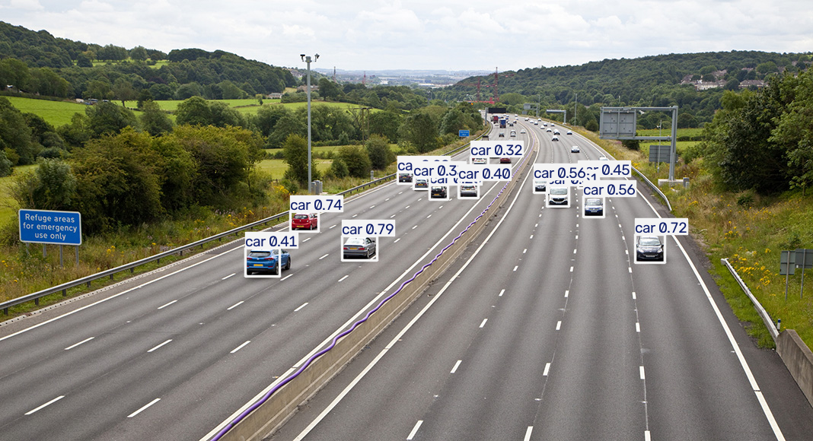
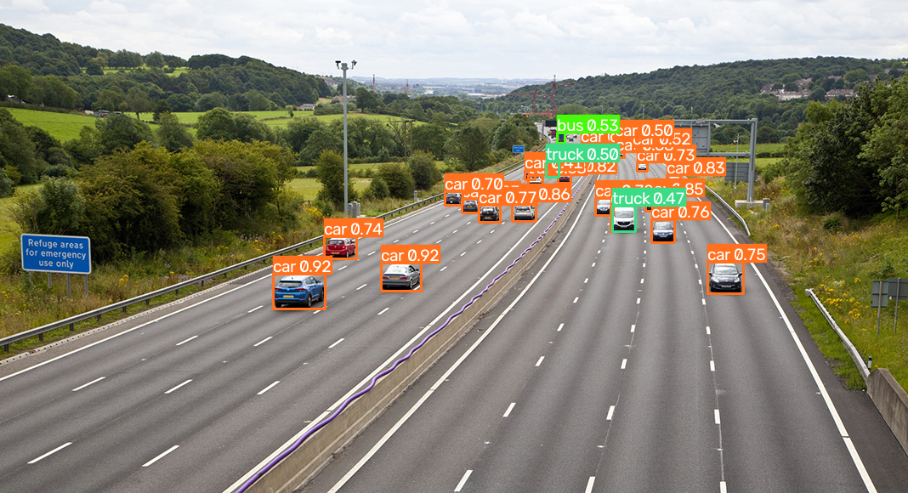
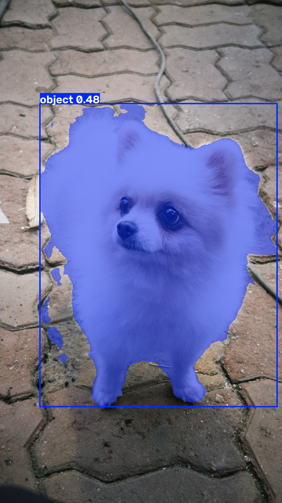

# 웹 개발 16일차 — YOLO가 미리 만들어둔 solutions 함수로 영상 분석하기

> 어제는 모델 이름(.pt)만 바꿔 끼우면 탐지·분류·분할·포즈가 다 된다는 걸 배웠다.
> 오늘은 한 단계 더 들어가서, YOLO(ultralytics)가 **미리 완성해둔 영상 분석 기능들**을 가져다 썼다.
> 사람 세기, 히트맵 그리기, 블러 처리, 속도 측정, 침입 알람 메일까지 — 만들려면 한참 걸릴 것 같은 기능들이 **함수 하나**로 끝났다.
> 그런데 18개나 실습하고 나서 깨달은 건, **코드 패턴이 전부 똑같았다**는 거다.

🖼️ **이미지 자리** — 오늘 실습한 solutions 함수 결과들 콜라주(추적/카운팅/히트맵/블러 등 대표 화면 모음). *직접 캡처해서 넣기.*

---

## 0. 오늘의 요약

- YOLO에는 `ultralytics.solutions`라는 **완제품 기능 모음**이 있다. 추적·카운팅·히트맵·블러·거리·속도·알람 등을 함수 하나로 쓴다.
- 이 solutions들은 **쓰는 패턴이 거의 다 똑같다** — `객체 생성 → while 루프에서 frame 넣기`. 하나 익히면 나머지는 이름만 바꾸면 된다.
- 정확도(SAHI)와 속도(OpenVINO 변환)를 끌어올리는 최적화 기법도 맛봤다.
- 오늘 실습 코드는 `hancom/13_yolo/advanced/` 안에 **교재 노드 순서대로 번호를 붙여** 정리했다(`01_yolo_track.py` … `19_yolo_streamlit.py`).

---

## 1. 오늘의 핵심 — solutions는 "패턴이 다 똑같다"

가장 크게 얻은 건 기능 18개가 아니라 **이 패턴 하나**다. 거의 모든 solutions가 이 뼈대를 공유한다.

```python
from ultralytics import solutions
import cv2

# 1. 영상 소스 열기 (웹캠 0, 동영상 파일, CCTV 스트림 URL 모두 가능)
cap = cv2.VideoCapture(source)

# 2. 쓰고 싶은 solutions 객체 생성 (여기 이름만 바꾸면 기능이 바뀜)
tool = solutions.무언가(model="yolo26n.pt", show=True)

# 3. 프레임을 하나씩 꺼내 객체에 그냥 넣는다
while cap.isOpened():
    success, frame = cap.read()
    if not success:
        break
    tool(frame)        # 탐지 + 처리 + 화면 표시까지 이 한 줄에서 다 함

    if cv2.waitKey(1) & 0xFF == ord('q'):   # q 누르면 종료
        break

cap.release()
cv2.destroyAllWindows()
```

한 줄씩 뜯어보면:
- `cv2.VideoCapture(source)` — 영상을 여는 손잡이. `0`이면 웹캠, `"영상.mp4"`면 파일, `"http://.../playlist.m3u8"`면 CCTV 실시간 스트림.
- `solutions.무언가(...)` — 이 **한 자리만 바꾸면** 기능이 통째로 바뀐다. `Heatmap`, `ObjectCounter`, `ObjectBlurrer`, `SpeedEstimator`…
- `tool(frame)` — 프레임을 넣으면 내부에서 **탐지 → 처리 → (show=True면) 창에 그리기**까지 알아서 다 한다. 우리가 박스 그릴 필요도 없다.

> 그래서 이 글도 "18개 기능 설명"이 아니라 **"이 자리에 뭘 넣느냐"** 로 읽으면 편하다.

한 가지 예외는 **추적(Tracking)** 인데, 이건 solutions가 아니라 모델에 직접 붙는 기능이다.

```python
from ultralytics import YOLO
import cv2

stream_url = "http://210.99.70.120:1935/live/cctv009.stream/playlist.m3u8"
cap = cv2.VideoCapture(stream_url)
model = YOLO("yolo26s.pt")

while cap.isOpened():
    success, frame = cap.read()
    if not success:
        break

    # persist=True → 이전 프레임에서 붙인 객체 ID를 계속 유지 (핵심)
    results = model.track(frame, persist=True, conf=0.6)
    annotated_frame = results[0].plot()

    cv2.imshow("YOLO_TRACKING", annotated_frame)
    if cv2.waitKey(1) & 0xFF == ord('q'):
        break
```

`model.track(..., persist=True)`의 `persist=True`가 오늘 배운 것 중 제일 중요한 옵션이었다. 이게 있어야 "1번 사람"이 다음 프레임에서도 계속 "1번 사람"으로 남는다. **뒤에 나오는 카운팅·속도 측정이 전부 이 추적 위에서 돌아간다.**

🖼️ **이미지 자리** — CCTV 스트림에 추적이 걸려서 각 객체에 ID 번호가 붙은 화면. *직접 캡처.*

---

## 2. 세고 · 추적하고 · 모으기 (Counter / Region / Heatmap)

영상 분석에서 제일 자주 쓰는 게 "몇 개 지나갔나", "이 구역에 몇 개 있나", "어디에 자주 나타나나"다.

### 2-1. 출입 카운팅 — `ObjectCounter` (IN / OUT)

선을 하나 그어두고 그 선을 넘는 객체를 방향까지 세어준다.

```python
count_points = [(234, 407), (620, 340)]   # 점 2개 = 가상의 선 하나

counter = solutions.ObjectCounter(
    model="yolo26n.pt",
    show=True,
    region=count_points        # 2점을 주면 '선', 4점을 주면 '영역'으로 동작
)

while cap.isOpened():
    success, frame = cap.read()
    if not success:
        break
    re_frame = cv2.resize(frame, (640, 480))   # 좌표계 맞추려고 크기 고정
    counter(re_frame)          # 탐지+추적+선 통과 판정+IN/OUT 카운트 전부 처리
```

- `region`에 **점 2개**를 주면 선(통과 카운팅), **점 4개**를 주면 영역이 된다는 게 포인트.
- `cv2.resize(frame, (640, 480))` — 내가 정한 선 좌표는 640×480 기준이라, 프레임도 같은 크기로 맞춰야 선이 엉뚱한 데 안 걸린다.

> **실무에선** 이게 제일 많이 쓰인다고 한다 — 매장 방문자 수 집계, 도로 교통량 카운팅, 출입구 인원 관리 같은 데. "몇 명이 들어오고 나갔나"가 곧 데이터가 되니까.

🖼️ **이미지 자리** — 선을 넘는 차량/사람에 IN/OUT 숫자가 올라가는 화면. *직접 캡처.*

### 2-2. 영역 카운팅 — `RegionCounter`

선이 아니라 **다각형 영역 안에** 지금 몇 개가 있는지 센다. 여러 구역을 동시에 볼 수도 있다.

```python
region_points = {
    "region-01": [(24, 11), (7, 475), (634, 476), (636, 6)],
    "region-02": [(192, 175), (180, 410), (439, 386), (273, 168)]
}

yolo_region = solutions.RegionCounter(
    model="yolo11n.pt",
    show=True,
    region=region_points,
    conf=0.1            # CCTV 저화질이라 임계값을 낮춰 더 잘 잡히게
)
```

`region_points`를 **딕셔너리**로 주면 구역마다 이름을 붙여 여러 개를 한 번에 셀 수 있다. 그런데 이 좌표는 어떻게 구했냐면 —

### 2-3. 마우스로 좌표 따오기 — `setMouseCallback`

영역 좌표를 눈대중으로 적을 순 없으니, 화면을 클릭해서 좌표를 뽑는 작은 도구를 따로 만들었다.

```python
points = []

def mouse_callback(event, x, y, flags, param):
    if event == cv2.EVENT_LBUTTONDOWN:      # 왼쪽 클릭한 순간
        points.append((x, y))
        print(f"클릭된 좌표는 {x, y} 입니다.")

cv2.namedWindow("GET_X_Y", cv2.WINDOW_NORMAL)
cv2.setMouseCallback("GET_X_Y", mouse_callback)   # 창에 클릭 이벤트 연결
```

클릭할 때마다 좌표가 출력되니, 그 숫자를 위 `region_points`에 그대로 붙여넣으면 된다. 실습이 이렇게 **도구를 만들어 → 그 결과를 다음 실습에 쓰는** 흐름으로 이어져서 재밌었다.

### 2-4. 히트맵 — `Heatmap`

객체가 **자주 머문 자리**를 열지도(빨강=많음)로 누적해서 보여준다.

```python
heatmap = solutions.Heatmap(
    model="yolo26n.pt",
    show=True,
    colormap=cv2.COLORMAP_MAGMA     # 색 테마
)

while cap.isOpened():
    success, frame = cap.read()
    if not success:
        break
    results = heatmap(frame)         # 프레임마다 누적해서 점점 진해짐
```

> **실무에선** 매장 동선 분석(어느 매대 앞에 사람이 몰리나), 주차장 점유 패턴 같은 데 쓴다. Region 카운팅이랑 묶으면 "어디에, 얼마나"가 한눈에 나온다.

🖼️ **이미지 자리** — 사람이 자주 지나간 자리가 붉게 달아오른 히트맵 화면. *직접 캡처.*

---

## 3. 거리 · 속도 재기 (Distance / Speed)

### 3-1. 거리 계산 — `DistanceCalculation`

화면에서 두 객체를 클릭하면 픽셀 거리를 재준다. 여기에 조건문을 얹어 **상태 판정**까지 해봤다.

```python
distance = solutions.DistanceCalculation(model="yolo26n.pt", show=True)

result_distance = 0
while cap.isOpened():
    success, frame = cap.read()
    if not success:
        break

    # process()가 돌려주는 결과에서 픽셀 거리 값만 꺼내 쓴다
    result_distance = distance.process(frame).pixels_distance

    if result_distance <= 50 and result_distance >= 1:
        print("객체간의 거리가 50이하로 가깝습니다.")
    elif result_distance > 50 and result_distance <= 100:
        print("객체간의 거리가 50에서 70사이로 중간정도입니다.")
    elif result_distance == 0:
        print("객체가 선택되지 않았습니다.")
    else:
        print("거리가 멉니다.")
```

`distance.process(frame).pixels_distance` 처럼 **결과 객체에서 원하는 값만 꺼내 쓰는** 걸 처음 해봤다. 그냥 `distance(frame)`으로 화면만 보는 것과 달리, 값을 직접 받아 내가 원하는 로직(가깝다/멀다)을 붙일 수 있다는 게 핵심.

### 3-2. 속도 추정 — `SpeedEstimator`

차량 속도를 km/h로 추정한다. 픽셀 이동량을 실제 거리로 환산하는 보정값이 필요하다.

```python
yolo_speed = solutions.SpeedEstimator(
    model="yolo11n.pt",
    show=True,
    max_speed=120,             # 이 값 넘는 속도는 표시 안 함
    meter_per_pixel=0.5,       # 픽셀 1개 = 실제 0.5m (환경마다 직접 보정 필수)
    classes=[2],               # COCO 클래스 2 = car (차량만)
    line_width=2
)
```

`meter_per_pixel`이 핵심이자 함정이었다. "픽셀 1개가 실제 몇 미터냐"를 **사람이 직접 재서 넣어야** 속도가 맞는다. 카메라 각도·거리마다 달라서, 이 값이 틀리면 속도도 통째로 틀린다. `classes=[2]`로 차만 골라 추적하는 것도 같이 배웠다.

🖼️ **이미지 자리** — 차량 위에 km/h 숫자가 뜬 속도 추정 화면. *직접 캡처.*

---

## 4. 실무 응용 — 프라이버시 · 보안 (Blur / Alarm)

### 4-1. 블러 처리 — `ObjectBlurrer`

탐지한 영역을 자동으로 모자이크한다.

```python
blurrer = solutions.ObjectBlurrer(
    model="yolo26n.pt",
    show=False,                # 창을 우리가 직접 띄우려고 False
    blurrer_ratio=0.5          # 블러 세기 (0.1~1.0)
)

while cap.isOpened():
    success, frame = cap.read()
    if not success:
        break
    results = blurrer(frame)              # 박스 영역 자동 블러
    cv2.imshow("BLUR", results.plot_im)   # 처리된 이미지를 직접 표시
```

`show=False`로 두고 `results.plot_im`(처리된 이미지 배열)을 꺼내 **직접 `imshow`** 하는 패턴. 창을 직접 다루니 나중에 저장·전송 같은 후처리를 붙이기 쉽다.

> **실무에선** 개인정보 보호에 거의 필수다. 유튜브·뉴스 영상의 얼굴/번호판 자동 블러, CCTV 공개본 처리 같은 데. `classes`로 사람·번호판만 골라 블러하면 딱이다.

🖼️ **이미지 자리** — 사람 얼굴/몸이 뿌옇게 블러 처리된 화면. *직접 캡처.*

### 4-2. 보안 알람 — `SecurityAlarm`

특정 객체가 감지되면 **이메일을 자동 발송**한다. 여기서 처음으로 "탐지 → 실제 행동(메일)"까지 이어봤다.

```python
from_email = "보내는주소@gmail.com"
password   = "앱 비밀번호 (일반 비번 아님)"
to_email   = "받는주소@gmail.com"

google_alarm = solutions.SecurityAlarm(
    model="yolo26n.pt",
    show=True,
    records=2,      # 같은 대상 2번 감지되면 1번 메일 (스팸 방지)
    classes=[2]     # 자동차 감지 시
)

google_alarm.authenticate(from_email, password, to_email)   # SMTP 인증 (1회)

while cap.isOpened():
    success, frame = cap.read()
    if not success:
        break
    google_alarm(frame)   # 감지 → 임계치 도달 시 메일 발송까지 내부 자동
```

포인트 두 가지:
- `password`는 Gmail **앱 비밀번호**여야 한다(일반 로그인 비번 X). 이걸 몰라서 처음에 인증이 안 됐다.
- `records=2` — 감지될 때마다 메일이 오면 스팸이 되니까, "N번 연속 감지되면 1번만" 보내는 안전장치.

> 코드 몇 줄로 "침입 감지 시 관리자에게 메일" 시스템의 뼈대가 나온다는 게 신기했다. 실제 보안 솔루션도 결국 이 구조(감지 → 알림)의 확장판일 거다.

---

## 5. 정확도 · 속도 최적화 (SAHI / OpenVINO)

기능을 쓰는 것에서 한 발 더 나가, **더 잘 잡고 · 더 빠르게 돌리는** 기법 두 개.

### 5-1. SAHI — 작은 물체 잡기

멀리서 찍은 항공/도로 사진은 물체가 너무 작아서 그냥 넣으면 잘 안 잡힌다. SAHI는 사진을 **작은 타일로 쪼개** 각각 추론한 뒤 합친다.

**(1) 그냥 통째로 추론 — 기준값**

```python
model = YOLO("yolo26n.pt")
results = model("demo_data/small-vehicles1.png")   # 사진 전체를 한 번에

detected = len(results[0].boxes)
print(f"탐지 수: {detected}")
```

**(2) SAHI로 타일 쪼개 추론**

```python
from sahi.predict import get_sliced_prediction
from sahi import AutoDetectionModel

detection_model = AutoDetectionModel.from_pretrained(
    model_type="ultralytics",
    model_path="yolo26n.pt",
    confidence_threshold=0.4
)

results = get_sliced_prediction(
    "demo_data/small-vehicles1.png",
    detection_model,
    slice_height=200,          # 타일 크기 200×200
    slice_width=200,
    overlap_height_ratio=0.1,  # 타일끼리 10% 겹치게 (경계 물체 놓침 방지)
    overlap_width_ratio=0.1
)
print(f"탐지 수: {len(results.object_prediction_list)}")
```

`slice_height/width`로 타일 크기를, `overlap_ratio`로 타일 간 겹침을 정한다. 겹치게 하는 이유는 타일 경계에 걸친 물체가 잘려서 안 잡히는 걸 막으려는 것. **같은 사진인데 타일로 쪼개니 탐지 수가 13개 → 25개로 확 늘었다.** 멀리 있어 작게 찍힌 차들까지 잡히고, 가까운 건 버스·트럭까지 구분됐다.

**① 기본 추론 — 13개 탐지 (가까운 차만)**



**② SAHI 슬라이싱 추론 — 25개 탐지 (멀리 있는 작은 차까지)**



### 5-2. OpenVINO 변환 — CPU에서 더 빠르게

GPU 없이 CPU만으로 돌릴 때, 모델을 OpenVINO 형식으로 바꾸면 훨씬 빨라진다.

```python
from ultralytics import YOLO

model = YOLO("yolo26n.pt")
model.export(format="openvino")   # yolo26n_openvino_model/ 폴더가 생김
```

그리고 진짜 빨라졌는지 **FPS를 직접 재서 비교**했다.

```python
import time

start_time = time.perf_counter()     # 시작 시각
results = model(frame, verbose=False)
end_time = time.perf_counter()       # 끝 시각

fps = 1 / (end_time - start_time)    # 1초 ÷ 한 장 걸린 시간 = FPS
```

- `time.perf_counter()` — 경과 시간 전용 시계. `time.time()`은 Windows에서 눈금이 굵어서 짧은 추론 시간을 재면 오차가 크다고 배웠다.
- 결과: 같은 웹캠 영상에서 기본 `.pt`가 **10~15 FPS**, OpenVINO 변환본이 **19~21 FPS** 정도로 확실히 빨라졌다.

> **실무에선** GPU 없는 현장 PC·엣지 장비에 배포할 때 이 변환이 거의 필수다. "정확도는 그대로, 속도만 올리는" 공짜 최적화라 안 할 이유가 없다.

---

## 6. 맛보기로 본 것들 (FastSAM / Search / Streamlit)

시간 관계상 깊게는 못 갔지만 "이런 것도 된다"로 훑은 것들.

- **FastSAM** — 텍스트로 원하는 것만 빠르게 분할. `model(source, texts="dog")` 한 줄로 사진에서 강아지만 오려냈다.
  ```python
  from ultralytics import FastSAM
  model = FastSAM("FastSAM-s.pt")
  results = model(source, texts="dog")   # "dog"라고 적으면 강아지만
  ```

  


- **SearchApp** — CLIP 임베딩으로 "비슷한 그림 찾기" 웹앱. `solutions.SearchApp(device="cpu").run()` 이면 브라우저가 열린다.

- **Streamlit UI** — 웹 대시보드에서 실시간 탐지. `solutions.Inference(...).inference()` 후 `streamlit run ./19_yolo_streamlit.py`로 실행.

---

## 7. 마무리 — 오늘 배운 것

- YOLO는 탐지만 하는 게 아니라, `solutions`로 **완성된 영상 분석 기능**까지 통째로 준다.
- 그 기능들은 **패턴이 다 똑같아서**(객체 생성 → `while` 루프에 frame) 하나 익히면 나머지는 이름만 갈아끼우면 됐다.
- 추적(`persist=True`)이 카운팅·속도의 바닥이 되고, SAHI·OpenVINO 같은 최적화까지 얹으면 "실제로 쓸 만한" 파이프라인이 된다.
- 무엇보다, "값을 직접 꺼내(`pixels_distance`) 내 로직을 붙이는" 감을 잡은 게 오늘의 진짜 수확이었다.

> 다음엔 이 기능들을 웹(Streamlit/Search)에 올려서 **화면으로 보여주는** 쪽으로 이어가 볼 생각이다.
