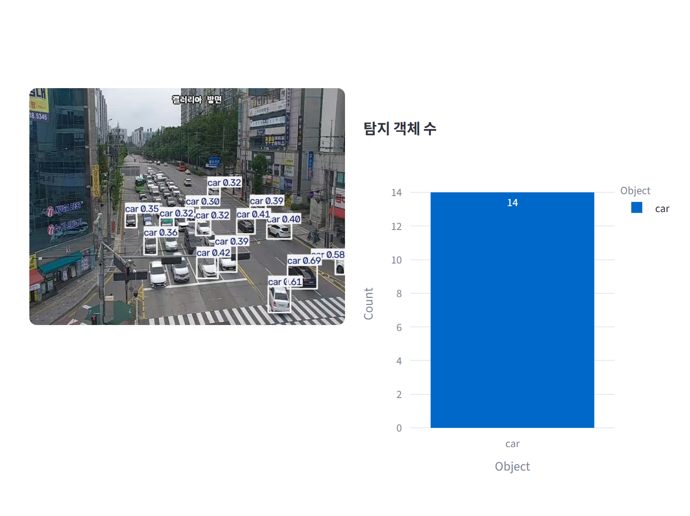
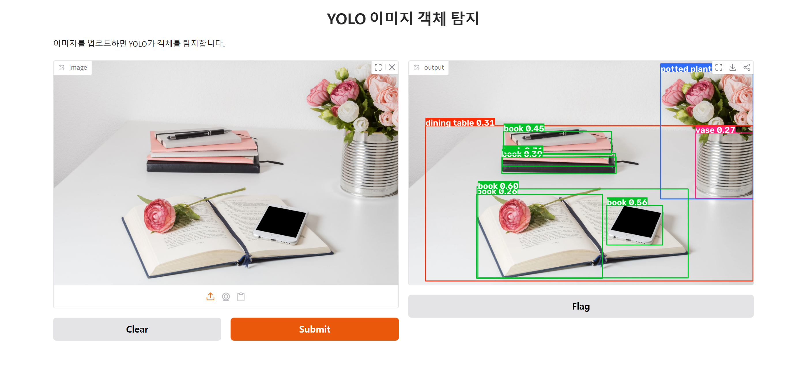

# 웹 개발 18일차 (1) — Streamlit vs Gradio: 같은 AI 기능, 다른 프레임워크로 만들기

> 어제 글을 "AI를 어디서 실행하느냐"는 축으로 정리했다.
> 오늘은 그 축이 하나 더 늘었다. **AI가 만든 결과를, 누구에게 어떻게 보여줄 것인가.**
> 어제까지는 결과를 전부 `print()`나 `cv2.imshow()`로 확인했다. 내 화면에서만, 코드를 직접 돌려야만 보이는 결과였다.
> 오늘은 그걸 **웹 브라우저**로 꺼내는 두 가지 도구를 배웠다 — Streamlit과 Gradio.
> 신기했던 건, 둘 다 결국 "어제 만든 YOLO 코드를 그대로 가져다 썼다"는 점이었다. 달라진 건 그 결과를 화면에 붙이는 방식뿐이었다.

---

## 0. 오늘의 요약

- 오늘은 `19_streamlit`, `20_gradio` 두 폴더에서 웹 프레임워크 두 개를 실습했다.
- 둘 다 파이썬 코드만으로 웹앱을 만든다는 점은 같지만, **화면을 다시 그리는 방식이 정반대**다. Streamlit은 "스크립트를 위에서 아래로 다시 실행"하고, Gradio는 "함수 하나를 콜백으로 연결"한다.
- 실습 환경은 오늘 새로 만든 `pyweb310`(conda, python 3.10) 가상환경 하나에 `streamlit`, `ultralytics`, `plotly`, `gradio`, `deep-translator`를 전부 설치해서 썼다.
- 이미지 두 장은 재현본이 아니라 **오늘 만든 코드를 실제로 그대로 실행해서 캡처한 것**이다 — CCTV는 실제 실시간 스트림이고, YOLO 탐지 결과도 실제 추론 결과다.
- 코드는 `hancom/19_streamlit`, `hancom/20_gradio`에 있다.

---

## 1. 오늘의 축 — "다시 그리는" 방식이 다르다

Streamlit과 Gradio는 둘 다 "파이썬 함수 → 웹 화면"을 만들어주는 도구지만, 화면이 갱신되는 원리가 근본적으로 다르다.

| | Streamlit | Gradio |
|---|---|---|
| 실행 단위 | **스크립트 전체**를 위→아래로 | **함수 하나**(`fn`) |
| 화면이 바뀌는 시점 | 위젯을 건드리면 스크립트를 처음부터 다시 실행(rerun) | 정해둔 콜백(버튼 클릭 등)이 호출될 때만 |
| 실시간 갱신 | `st.empty()`로 만든 빈 자리를 반복문 안에서 계속 덮어쓰기 | 기본은 "입력 한 번 → 출력 한 번"에 최적화 |
| 무거운 리소스(모델) | 매번 다시 로드되지 않게 `@st.cache_resource`로 캐싱 필요 | 함수 바깥(전역)에 한 번만 로드해두면 끝 |
| 빠른 공유 | 없음(로컬 서버, 별도 배포 필요) | `launch(share=True)` 한 줄로 임시 공개 URL 생성 |

이 표를 먼저 보고 코드를 보면 "왜 이렇게 짰지"가 훨씬 잘 보인다.

---

## 2. Streamlit — 스크립트를 통째로 다시 그리는 웹앱 (`19_streamlit`)

### 2-1. 가상환경부터

실습 전에 새 conda 환경을 만들었다.

```bash
conda create -n pyweb310 python=3.10
conda activate pyweb310
(pyweb310) pip install streamlit
(pyweb310) pip install ultralytics plotly
```

어제 정리한 것처럼 실습마다 환경을 나누는 이유는 명확하다 — 패키지 버전 충돌을 막기 위해서다. `ultralytics`를 설치하면 `opencv-python`이 의존성으로 같이 따라온다.

### 2-2. YOLO 실시간 CCTV 탐지 (`v19_01_streamlit_b.py`)

```python
import streamlit as st           # 웹앱 만드는 도구 (코드 → 웹화면)
from ultralytics import YOLO     # 사물 찾는 AI 라이브러리
import cv2                        # 영상·이미지 처리 도구 (OpenCV)


#1. Streamlit 페이지 기본 설정 - 웹 모양 결정
st.set_page_config(layout="wide") # 화면을 가로로 넓게 사용 (꼭 코드 맨 위)
st.title("YOLO 실시간 CCTV 탐지") # 페이지 맨 위에 큰 제목 표시

#2 영상 출력용 공간 설정 - 영상이 들어갈 빈 액자 준비
frame_placeholder = st.empty() # 사진을 계속 갈아끼울 자리 (placeholder)

#3 CCTV 비디오 스트림 연결 - 인터넷 CCTV 카메라 접속
cap = cv2.VideoCapture("http://210.99.70.120:1935/live/cctv013.stream/playlist.m3u8")

#4 모델 로드 - 사물 인식 AI 모델 불러오기
model = YOLO("yolo26n.pt") # yolo26n.pt = 이미 학습된 AI 파일

#5 비디오 프레임 처리 - CCTV 영상을 한 장씩 분석 반복
while cap.isOpened():   # CCTV 연결되어 있는 동안 계속 반복
    success, frame = cap.read() # 영상에서 사진 한 장 가져오기
    if not success:
        print("프레임 읽기 실패")
        st.warning("프레임 읽기 실패(Streamlit)")
        break

    #5-1 모델로 객체 탐지 수행 -AI 사진 보여주며 분석 요청
    results = model(frame)

    #5-2. 탐지 결과를 이미지에 시각화 - 찾은 사물에 네모 박스 그리기
    annotated_frame = results[0].plot()

    #5-3. Streamlit placeholder에 프레임 갱신 - 빈 액자에 결과 사진 표시
    frame_placeholder.image(annotated_frame, channels="BGR") # BGR = OpenCV 색 순서 

#6. 자원 해제 - 끝나면 카메라 창 닫기 (메모리 정리)
cap.release()
cv2.destroyAllWindows()
```

핵심은 딱 두 줄이다.

```python
frame_placeholder = st.empty()          # ① 빈 자리를 미리 하나 확보
frame_placeholder.image(annotated_frame, channels="BGR")   # ② 그 자리를 반복해서 덮어쓰기
```

- **`st.empty()`** — "여기에 뭔가 들어올 거다"라고 자리만 예약해두는 함수다. 이 자리를 변수(`frame_placeholder`)로 들고 있으면, 나중에 그 변수에 `.image()`를 다시 호출할 때마다 **화면 전체가 아니라 그 자리만** 새 이미지로 바뀐다.
- **`channels="BGR"`** — OpenCV는 색을 파랑-초록-빨강(BGR) 순서로 다룬다. 반면 웹 화면(브라우저)은 보통 빨강-초록-파랑(RGB)을 기대한다. 이 옵션을 안 주면 색이 반전돼서 나온다. `results[0].plot()`이 OpenCV 형식(BGR)으로 그려주기 때문에 여기서 꼭 명시해야 한다.
- **`while cap.isOpened():`** — 어제 YOLO 실습에서 본 것과 똑같은 반복문이다. 어제는 `cv2.imshow()`로 새 창을 띄웠는데, 오늘은 그 자리에 `frame_placeholder.image()`가 들어갔을 뿐이다. **영상 처리 로직 자체는 하나도 안 바뀌었다.**

### 2-3. 좌/우 컬럼 + Plotly 그래프 동시 갱신 (`v19_02_streamlit_graph.py`)

두 번째 파일은 여기서 한 단계 더 나간다. 영상 옆에 **탐지된 객체 수를 막대그래프로** 같이 보여준다.

```python
import streamlit as st             # 웹앱 도구
from ultralytics import YOLO       # 사물 찾는 AI
import cv2                          # 영상 처리 도구
import pandas as pd                 # 표(엑셀 같은) 만드는 도구
import plotly.express as px         # 그래프 그리는 도구 (pip install plotly)
import time                         # 시간 측정용

#1. 화면 구성 - 화면을 좌 우 2칸으로 분할
# 좌/우 컬럼 생성
col1, col2 = st.columns(2)  # 같은 너비 두 칸 만들기

with col1:      # 왼쪽 칸
    frame_placeholder = st.empty()  # 왼쪽 컬럼 : YOLO 프레임 표시용 (빈 영역)

with col2:  # 오른쪽 칸
    chart_placeholder = st.empty()   # 객체 수 그래프 표시용 빈 영역

#2. 비디오 경로 설정 - CCTV 주소 연결
cap = cv2.VideoCapture("http://210.99.70.120:1935/live/cctv013.stream/playlist.m3u8")

#3. 모델 로드 - AI 두뇌 불러오기 (캐시로 1회만 로드)
@st.cache_resource  # 모델,DB 같은 무거운 자원 캐싱 (재실행해도 1번만 로드)
def load_model():
# 캐시 안 쓰면 화면 조작으로 스크립트가 실행될때 마다 모델을 새로 읽어서 느려짐
    return YOLO("yolo26n.pt")   

model = load_model()    # 두 번째 호출부터 캐시에서 즉시 반환

# 4. 비디오 프레임 처리 — 영상 한 장씩 분석 + 그래프 동시 갱신
while cap.isOpened():
    success, frame = cap.read()
    if not success:
        st.warning("CCTV FRAME ERROR")
        break

    # 4-1. YOLO 모델 객체 탐지 수행 — AI한테 사진 보여주기
    results = model(frame)

    # 4-2. 탐지 결과가 그려진 프레임 이미지 생성 — 네모 박스 그리기
    annoated_frame = results[0].plot()

    #4-3. 탐지된 객체의 클래스 이름 추출
    labels = [model.names[int(c)] for c in results[0].boxes.cls]

    #4-4. 탐지 객체 수 시각화 - 종류별 개수 세서 막대 그래프 만들기 
    if labels:  #뭔가 찾았다면
        # labels 리스트를 DataFrame으로 변환 후 객체별 개수 집계
        df_count = pd.DataFrame({"Object" : labels})
        df_count = df_count.value_counts().reset_index(name="Count") # 종류별 개수 세기

        #Plotly를 이용해 막대 그래프 생성
        fig = px.bar(
            df_count,
            x="Object", # 가로축 = 사물 이름
            y="Count",  # 세로축 = 개수
            title="탐지 객체 수",   
            color="Object", # 사물마다 색 다르게 
            text="Count"    # 막대 위 숫자 표기 
        )
    else:
        df_count = pd.DataFrame({"Object": [], "Count": []})    # 빈 표 만들기
        fig = px.bar(
            df_count,
            x="Object",
            y="Count",
            title="탐지 객체 수"
        )

    # 4-5. Streamlit에 결과 표시 — 왼쪽 영상 + 오른쪽 그래프 동시 갱신
    frame_placeholder.image(annoated_frame, channels="BGR")
    chart_placeholder.plotly_chart(fig, use_container_width=True, key=f"chart_{time.time()}")
    # key=f"chart_{time.time()}" — 매번 다른 이름 줘서 위젯 충돌 막기

# 5. 자원해제 — CCTV 연결 끊고 창 닫기
cap.release()
cv2.destroyAllWindows()
```

실제로 `pyweb310` 환경에서 이 파일을 직접 돌려서 캡처한 화면이다. 이 시각 CCTV엔 차와 버스가 지나가고 있었다.



한 줄씩 뜯어보면:

- **`col1, col2 = st.columns(2)`** — 화면을 가로로 2등분한다. 이후 `with col1:` 블록 안에 넣은 위젯은 왼쪽에, `with col2:` 안은 오른쪽에 배치된다. 레이아웃을 파이썬 들여쓰기만으로 잡는다는 게 신기했다.
- **`@st.cache_resource`** — 2-2 버전에서 `model = YOLO("yolo26n.pt")`는 while 루프 바깥에 있어서 원래도 한 번만 실행되긴 한다. 하지만 Streamlit은 사용자가 화면의 위젯(버튼, 슬라이더 등)을 조작할 때마다 **스크립트 전체를 처음부터 다시 실행**하는 게 기본 동작이다. 그때마다 모델을 다시 읽으면 매번 몇 초씩 걸린다. `@st.cache_resource`를 붙이면 "이 함수 결과는 한 번 계산하면 계속 재사용"하게 된다.
- **`labels = [model.names[int(c)] for c in results[0].boxes.cls]`** — `results[0].boxes.cls`는 탐지된 객체마다 붙는 **클래스 번호**(예: 2, 2, 5 ...) 리스트다. `model.names`는 `{0: "person", 2: "car", 5: "bus", ...}` 같은 번호→이름 사전이다. 이 한 줄이 번호를 실제 이름(`"car"`, `"bus"`)으로 바꿔준다.
- **`df_count.value_counts().reset_index(name="Count")`** — `["car", "car", "car", "bus"]` 같은 리스트를 `car: 3, bus: 1` 표로 집계한다. pandas의 개수 세기 패턴이다.
- **`key=f"chart_{time.time()}"`** — Plotly 그래프도 매 반복마다 새로 그리는데, Streamlit은 같은 위젯을 두 번 그리면 "이름이 겹친다"고 에러를 낸다. `time.time()`(현재 시각, 소수점까지 다른 값)을 이름 뒤에 붙여서 매번 고유한 이름을 만들어 이 문제를 피했다.

왼쪽엔 실제 도로 CCTV에 `car`, `bus` 박스가 그려지고, 오른쪽엔 그 개수가 막대그래프로 실시간 집계된다. **어제 만든 YOLO 탐지 로직은 그대로고, 그 결과를 표로 세서 그래프로 뽑는 부분만 오늘 새로 얹은 것**이다.

---

## 3. Gradio — 함수 하나가 곧 웹앱 (`20_gradio`)

Streamlit이 "화면 전체를 코드로 그리는" 방식이라면, Gradio는 **"함수 하나를 골라서 입출력 창을 자동으로 만들어주는"** 방식이다.

### 3-1. 제일 단순한 형태 (`v20_01_gradio.py`)

```python
import gradio as gr

# 1. 간단한 함수 정의
def say_hello(name):
    """
    사용자가 입력한 이름을 받아 실행되는 함수
    """
    return "Hello, " + name

# 2. Gradio 인터페이스 생성
gr_web = gr.Interface(
    fn=say_hello,    # 실행할 함수
    inputs="text",   # 텍스트 입력창
    outputs="text",  # 텍스트 출력창
)

# 3. 웹앱 실행 (share=True → 공개 URL)
gr_web.launch(share=True)
```

- **`gr.Interface(fn=..., inputs=..., outputs=...)`** — 딱 세 가지만 정하면 끝이다. **어떤 함수를(`fn`), 뭘 받아서(`inputs`), 뭘 돌려주는지(`outputs`)**. Gradio가 나머지(입력창, 버튼, 출력창 배치)를 전부 알아서 만든다.
- **`inputs="text"`** — 문자열로 컴포넌트 종류를 지정하면 Gradio가 기본 텍스트박스를 만들어준다. 뒤에 나올 `gr.Image(type="numpy")`처럼 객체로 더 세밀하게 지정할 수도 있다.
- **`launch(share=True)`** — 이 옵션 하나로 Gradio가 임시 공개 URL(`*.gradio.live`)을 만들어준다. 로컬 PC에서 돌려도 다른 사람에게 링크만 보내면 접속해서 써볼 수 있다. Streamlit엔 없는 기능이다.

### 3-2. 번역 앱 (`v20_02_gradio_trans.py`)

```python
import gradio as gr
from deep_translator import GoogleTranslator

# 1. 번역 함수 정의 (영어 → 한국어)
def trans_en_to_ko(text):
    translated = GoogleTranslator(
        source="en",
        target="ko"
    ).translate(text)

    return translated

# 2. Gradio 웹 인터페이스 생성 + 실행
gr.Interface(
    fn=trans_en_to_ko,
    inputs="text",
    outputs="text",
    title="Simple Translation Website",
    description="영어 문장을 입력하면 한국어로 번역됩니다."
).launch()
```

`deep_translator`의 `GoogleTranslator`는 어제 OCR 실습에서 T5 요약 모델이 한국어를 못 해서 대신 썼던 그 라이브러리다. 어제는 "번역 결과를 보조로 붙이는" 용도였는데, 오늘은 **번역 자체가 앱의 주인공**이 됐다. `fn=trans_en_to_ko`만 갈아끼우면 3-1의 인사 앱이 번역 앱으로 통째로 바뀐다는 게 이 구조의 핵심이다.

### 3-3. YOLO 이미지 탐지 (`v20_03_gradio_yolo.py`)

```python
import gradio as gr
from ultralytics import YOLO

# 1. 모델 로드 (파일 없으면 자동 다운로드)
model = YOLO("yolo11n.pt")

# 2. 이미지 탐지 함수
def det_image(image):
    results = model(image)
    annotated_image = results[0].plot()
    return annotated_image

# 3. gradio 웹 인터페이스 생성 + 실행
gr.Interface(
    fn=det_image,
    inputs=gr.Image(type="numpy"),
    outputs=gr.Image(),
    title="YOLO 이미지 객체 탐지",
    description="이미지를 업로드하면 YOLO가 객체를 탐지합니다."
).launch()
```

- **`model = YOLO("yolo11n.pt")`** — 이 줄이 `gr.Interface`나 함수 안이 아니라 **파일 맨 위**에 있다는 게 중요하다. Gradio는 함수(`det_image`)가 호출될 때마다 실행되지만, 이 모델 로드 줄은 앱이 처음 켜질 때 딱 한 번만 실행된다. Streamlit의 `@st.cache_resource`가 하던 일을, Gradio에서는 그냥 **전역 변수로 한 번만 선언**하는 것으로 해결한다.
- **`inputs=gr.Image(type="numpy")`** — 이번엔 문자열(`"text"`) 대신 `gr.Image` 객체를 직접 썼다. `type="numpy"`는 업로드된 이미지를 OpenCV/YOLO가 바로 쓸 수 있는 numpy 배열로 달라는 뜻이다. YOLO의 `model(image)`는 numpy 배열을 그대로 입력으로 받는다.

실제로 `hancom/13_yolo/basic/input_params.jpg`(예전 YOLO 실습 때 쓴, 책·꽃·휴대폰이 있는 사진)를 업로드해서 돌려본 결과다.



왼쪽이 업로드한 원본, 오른쪽이 탐지 결과다. `book`(책) 4개, `potted plant`(화분), `vase`(꽃병), `dining table`(테이블)까지 잡혔다. 신뢰도 점수(`book 0.60`처럼 박스 위에 붙은 숫자)가 대체로 0.3~0.6대로 그렇게 높진 않은데, `yolo11n`이 가장 가벼운(nano) 버전이라 정확도보다 속도를 우선한 모델이기 때문이다.

### 3-4. Blocks + Tab으로 세 앱을 하나로 합치기 (`v20_04_gradio.py`)

마지막 파일은 `gr.Interface`가 아니라 `gr.Blocks`를 쓴다. 앞의 세 함수를 탭 3개로 묶는다.

```python
import gradio as gr
from deep_translator import GoogleTranslator
from ultralytics import YOLO

model = YOLO("yolo11n.pt")

# 1. 지금까지 만든 함수 3개 그대로 가져오기 (손댈 필요 없음)
def say_hello(name):
    return "Hello, " + name

def trans_en_to_ko(text):
    return GoogleTranslator(source="en", target="ko").translate(text)

def det_image(image):
    results = model(image)
    return results[0].plot()

# 2. 탭 3개로 묶기
with gr.Blocks() as gr_web:
    gr.Markdown("# 내가 만든 AI 앱 모음")   # 마크다운으로 제목

    with gr.Tab("인사"):
        name_box = gr.Textbox(label="이름")
        hello_out = gr.Textbox(label="인사말")
        # .click(실행할 함수, 읽어올 칸, 결과 쓸 칸)
        gr.Button("인사하기").click(say_hello, name_box, hello_out)

    with gr.Tab("번역"):
        en_box = gr.Textbox(label="영어")
        ko_box = gr.Textbox(label="한국어")
        gr.Button("번역하기").click(trans_en_to_ko, en_box, ko_box)

    with gr.Tab("YOLO 탐지"):
        img_in = gr.Image(type="numpy", label="사진 올리기")
        img_out = gr.Image(label="탐지 결과")
        gr.Button("탐지하기").click(det_image, img_in, img_out)

gr_web.launch(share=True)
```

`gr.Interface`는 "함수 하나 = 앱 하나"라 편하지만, 앱 하나에 기능을 여러 개 넣고 싶으면 한계가 있다. `gr.Blocks`는 그 반대로 **레이아웃과 동작을 직접 조립**한다.

- **`with gr.Tab("인사"):`** — `with` 블록 안에 넣은 컴포넌트가 그 탭 안에 들어간다. 탭 3개를 만드는 게 파이썬 들여쓰기 3번으로 끝난다.
- **`gr.Button("인사하기").click(say_hello, name_box, hello_out)`** — `.click(함수, 입력, 출력)` 패턴이다. "이 버튼을 클릭하면, `say_hello` 함수를 실행하는데 입력은 `name_box`에서 가져오고 결과는 `hello_out`에 넣어라"는 뜻이다. `gr.Interface`가 자동으로 해주던 "입력→함수→출력" 연결을, 여기선 한 줄로 직접 지정한다.
- 세 함수(`say_hello`, `trans_en_to_ko`, `det_image`) 자체는 3-1~3-3에서 만든 것과 **완전히 동일**하다. 바뀐 건 그 함수들을 화면에 배치하는 방식뿐이다.

---

## 4. 오늘 정리 — 언제 뭘 쓸까

같은 "YOLO 결과를 웹에 보여주기"를 두 프레임워크로 다 해보고 나니, 차이가 실전 감각으로 남았다.

- **Streamlit**은 `while` 루프 + `st.empty()` 조합이 자연스러워서, **끊임없이 갱신되는 대시보드**(오늘의 CCTV 실시간 탐지 같은 것)에 잘 맞았다.
- **Gradio**는 `fn` 하나 던지면 끝이라, **"입력 하나 넣고 결과 하나 받는" 데모**를 순식간에 만드는 데 특화돼 있었다. `share=True` 한 줄로 링크를 뿌릴 수 있다는 것도 컸다 — 발표나 시연할 때 서버 배포 없이 바로 공유 가능하다는 뜻이다.
- 반대로 Gradio로 실시간 스트림을 만들려면 `while` 루프를 그대로 못 쓰고 별도의 스트리밍 API를 써야 하고, Streamlit으로 순간적인 데모를 만들려면 `share=True` 같은 원클릭 공유 기능이 없다. **둘은 경쟁 관계라기보단 용도가 다른 도구**라는 게 오늘의 결론이다.

---

다음 글에서는 오늘 배운 Claude Code 심화 설정(권한 모드, 상태줄, 스킬 생태계)을 정리한다.
